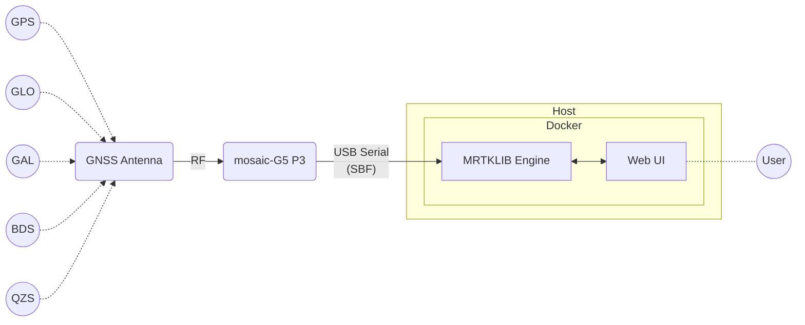

# mrtklib-quickstart

**Experience real-time PPP positioning with MADOCA-PPP** using a Septentrio
mosaic-G5 receiver and [MRTKLIB](https://github.com/h-shiono/MRTKLIB) — packaged
so it runs even if you are not comfortable with Docker.

This repository wraps
[mrtklib-docker-ui](https://github.com/h-shiono/mrtklib-docker-ui) with
OS-specific launch / first-run scripts (Windows / macOS / Linux) and the
OS-independent teaching material, all in one place. A single `start` script
configures the receiver, attaches its USB, launches the container, and opens the
web UI.

## What you'll need

**Hardware**

- Septentrio **mosaic-G5 P3** evaluation kit
- A full-band GNSS antenna (e.g. Yokowo YOZ-52728), placed with a clear sky view
- A USB cable to connect the receiver to the host PC

**Software**

- Windows 11 (macOS / Linux also supported)
- Docker Desktop

WSL2, usbipd-win and the receiver driver (RxTools) are installed as part of the
guide — see the install chapter for your OS.

## How it works



The receiver observes GPS / GLONASS / Galileo / BeiDou / QZSS and outputs the raw
measurements plus the QZSS L6 corrections as SBF; MRTKLIB (in Docker) computes the
PPP solution and shows it in the web UI.

---

## Who are you? (routing for three audiences)

### 1. Participant — "I just want it to run"

Run the script for your OS. See the docs for detailed steps.

| OS | File to run | Steps |
|----|-------------|-------|
| Windows | [`scripts/windows/start.bat`](scripts/windows/start.bat) | [Windows guide](docs/en/30-run-windows.qmd) |
| macOS | [`scripts/macos/start.command`](scripts/macos/start.command) | [macOS guide](docs/en/31-run-macos.qmd) |
| Linux | (coming soon) | — |

### 2. Learner — "I want to understand how it works"

📖 **Documentation site** (built with Quarto, published to GitHub Pages)

- Overview / big picture → [`docs/en/00-overview.qmd`](docs/en/00-overview.qmd)
- MADOCA-PPP: where it sits and why it converges → [`docs/en/10-concepts.qmd`](docs/en/10-concepts.qmd)
- How to read the UI (convergence) → [`docs/en/50-using-ui.qmd`](docs/en/50-using-ui.qmd)

> The docs are bilingual (`docs/en/` / `docs/ja/`), generated as HTML and PDF
> from a single Quarto source.

### 3. Maintainer — "I want to fix the scripts"

See the technical notes for each script group.

- [`scripts/windows/README.md`](scripts/windows/README.md)
- [`scripts/macos/README.md`](scripts/macos/README.md)

---

## Repository layout

```
mrtklib-quickstart/
├─ README.md              # this entry point
├─ scripts/               # OS-specific launch/setup scripts (the shell)
│  ├─ windows/
│  └─ macos/
├─ docs/                  # OS-independent body text (the substance); bilingual, Quarto single source
├─ .github/workflows/     # CI for docs publishing / PDF release
└─ .gitignore
```

## License

See [LICENSE](LICENSE).
