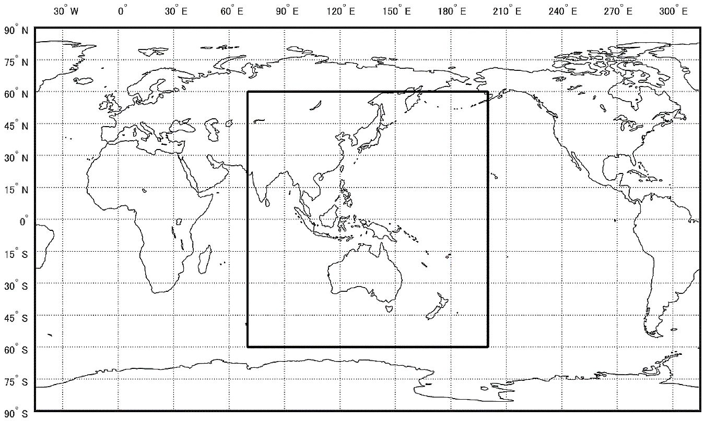
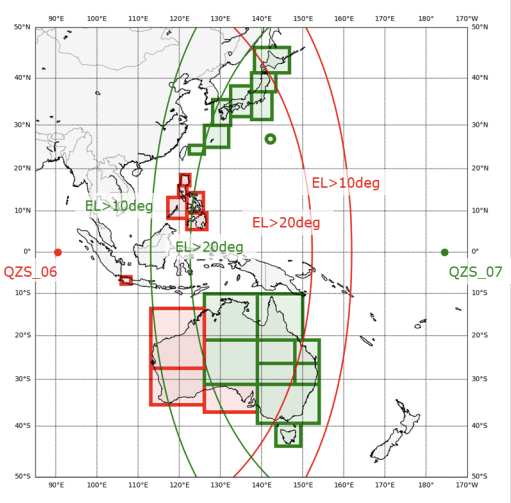

# Concepts

<!-- What MADOCA-PPP is, where it sits among positioning methods, and why it
     converges the way it does. Assumes a positioning-literate reader. -->

## What is MADOCA-PPP {#sec-about-madoca-ppp}

**MADOCA-PPP (Multi-GNSS Advanced Orbit and Clock Augmentation - Precise Point Positioning)** is one of the types of correction data delivered via the L6 signal of the Quasi-Zenith Satellite System (QZSS).
It is available where at least one QZS with an elevation of 10 degrees or more, and at least 20 augmented satellites with an elevation of 10 degrees or more, are visible.

<figure markdown="1" id="fig-madoca-ppp-service-area">

<figcaption markdown="span">MADOCA-PPP service area[^1]</figcaption>
</figure>

[^1]: High-precision positioning augmentation service (MADOCA-PPP), QSS, https://qzss.go.jp/technical/system/madoca.html, accessed 2026-07-15

Using MADOCA-PPP correction data enables Precise Point Positioning, achieving centimeter-level positioning accuracy.
The service is delivered via the L6E signal and includes correction data for satellite orbit, clock, and bias.
The GNSS constellations augmented are GPS, GLONASS, Galileo, BeiDou, and QZSS.
Depending on the algorithm used, it takes about 30 minutes to reach an accuracy of a few tens of centimeters to centimeter level.

Starting in 2025, the buildout of the 7-satellite QZSS constellation began.
Along with this, **wide-area ionospheric correction data is to be delivered via the L6D signal of QZS6 and QZS7**.
Used together with the existing L6E signal, this has made it possible to shorten convergence time to **about 10 minutes**.

<figure markdown="1" id="fig-madoca-ppp-iono-service-area">

<figcaption markdown="span">MADOCA-PPP wide-area ionospheric correction service area[^2]</figcaption>
</figure>

[^2]: Coverage area of MADOCA-PPP ionospheric correction data, QSS, https://qzss.go.jp/en/technical/download/pdf/ps-is-qzss/Coverage%20area%20of%20MADOCA-PPP%20ionospheric%20correction%20data_20250714.pdf, accessed 2026-07-16

!!! danger "Important"

    The wide-area ionospheric correction service is currently under technical demonstration.
    See the Service Level Information below for details.

    [Quasi-Zenith Satellite System Service Level Information for Multi-GNSS Advanced Orbit and Clock Augmentation – Precise Point Positioning Technology Demonstration (Ionospheric Correction) (SLI-MDC-ION, Draft)](https://qzss.go.jp/en/technical/download/pdf/ps-is-qzss/sli-mdc-ion-draft.pdf) (February 2022)

    In addition, as of 2026-08-30, QZS7 ([QZS satellites and their high-precision positioning services](#tbl-qzs-has)), which will deliver L6D covering Japan, is undergoing on-board equipment functional checks and **is not yet transmitting a signal**[^3].
    Since the wide-area ionospheric correction cannot be received within Japan, convergence remains about 30 minutes with MADOCA-PPP alone.
    In the Philippines, Indonesia, and western Australia, delivery from QZS6 is available.

Through this guide, you will experience this MADOCA-PPP wide-area ionospheric correction service.

## Correction data delivered by QZSS and how it fits in {#sec-qzss-corrections}

Two types of correction data are delivered via the QZSS L6 signal.
One is the Centimeter Level Augmentation Service (CLAS), which covers all of Japan and is characterized by reaching centimeter-level accuracy in about 1 minute.
The other is MADOCA-PPP, which covers the QZSS visibility area (Asia and Oceania) and is characterized by reaching centimeter-level accuracy in several tens of minutes.
What the two have in common is that **the correction data is received via satellite delivery from QZSS, not over a communication link**.
This means you can start precise positioning with just the receiver, without needing a base station or a cellular connection.

<figure class="md-table-figure" markdown id="tbl-comp-pos-algorithm">
<figcaption>Comparison of high-precision positioning methods</figcaption>

| Positioning method | Correction delivery | Coverage | Convergence (approx.) | Communication infrastructure |
| --- | --- | --- | --- | --- |
| RTK | Communication with base station | Baseline ~10 km | A few seconds | Required |
| Network RTK (VRS) | Communication with base station network | Regional (network coverage) | A few seconds | Required |
| CLAS (PPP-RTK) | QZSS satellite delivery (L6D) | Within Japan | About 1 minute | Not required |
| **MADOCA-PPP** | QZSS satellite delivery (L6E) | QZSS visibility area ([service area](#fig-madoca-ppp-service-area)) | About 30 minutes | Not required |
| **MADOCA-PPP + wide-area ionospheric correction** | QZSS satellite delivery (L6E + L6D) | Wide area ([service area](#fig-madoca-ppp-iono-service-area)) | **About 10 minutes** | Not required |

</figure>

RTK / Network RTK provide centimeter-level accuracy instantly, but they are constrained by distance to the base station and additionally require a communication link to receive correction data.
CLAS (PPP-RTK) is a technology positioned between RTK and PPP: it does not cover as wide an area as PPP, but it is characterized by achieving RTK-level convergence over a wider area than RTK.

MADOCA-PPP trades off convergence time for the ability to cover a wide area using satellite delivery alone.

### QZS satellites and high-precision positioning services {#sec-qzs-has}

The high-precision positioning services delivered via the L6 signal by each QZS satellite are shown in [the table below](#tbl-qzs-has).

<figure class="md-table-figure" markdown id="tbl-qzs-has">
<figcaption>QZS satellites and their high-precision positioning services</figcaption>

| Satellite | L6D PRN | L6D delivered service | L6E PRN |
| :----- | --- | :--- | --- |
| QZS2      | 194 | CLAS (2) | 204 |
| QZS4      | 195 | CLAS (1) | 205 |
| QZS1R     | 196 | CLAS (2) | 206 |
| QZS3      | 199 | CLAS (1(\*1), 2) | 209 |
| QZS6      | 200 | MADOCA-PPP wide-area ionospheric correction (Philippines, Indonesia, western Australia) | 210 |
| QZS7(\*2) | 201 | MADOCA-PPP wide-area ionospheric correction (Japan, eastern Australia) | 211 |

</figure>

- L6E: all satellites deliver MADOCA-PPP (orbit, clock, and phase bias corrections).
- The number in parentheses for CLAS indicates the delivery pattern.
- (\*1) Pattern 1 is normally delivered, but pattern 2 may be delivered if another satellite becomes unavailable for an extended period for some reason.
- (\*2) As of 2026-08-30, the status is In commissioning (trial operation); no signal is transmitted yet because on-board equipment functional checks are in progress.
- QZS1 has been replaced by QZS1R. QZS5 was lost due to the launch failure of H3 Launch Vehicle No. 8 (2025-12-22) and is therefore not included in this table[^4].

[^3]: Michibiki-7 has entered a quasi-geostationary orbit, QSS, https://qzss.go.jp/info/information/qzs7_260822.html, accessed 2026-08-30

[^4]: Regarding the launch failure of H3 Launch Vehicle No. 8 and the loss of Quasi-Zenith Satellite System "Michibiki-5", QSS, https://qzss.go.jp/info/information/qzs-5_251225.html, accessed 2026-08-30

What you will experience in this guide is **MADOCA-PPP + wide-area ionospheric correction**, which shortens convergence by using each satellite's L6E together with the L6D from QZS6/QZS7.

## Float PPP and PPP-AR/Iono {#sec-ppp-modes}

PPP convergence time varies greatly depending on how the **integer ambiguity** of the carrier phase is handled.

- **Float PPP** — a method that estimates the ambiguity as a real number, which takes several tens of minutes to converge.
- **PPP-AR (Ambiguity Resolution)** — a method that resolves the ambiguity using phase bias corrections, improving accuracy and convergence. MADOCA-PPP delivers this bias correction via L6E, making PPP-AR available.
- **PPP-AR/Iono** — applying the wide-area ionospheric correction (L6D) further helps resolve the ambiguity, shortening convergence time to about 10 minutes.

In this guide, you will run this **PPP-AR/Iono** mode and observe the convergence behavior in the UI.

## Data output by the receiver {#sec-receiver-output}

The PPP engine performs its computation by applying the **correction data** arriving via QZSS L6 to the **raw measurements** (pseudorange and carrier phase) measured by the receiver itself.
In this guide's configuration, both are combined into a single SBF stream (the `Support` message group) and output from the receiver's `USB1` port.

When you connect the receiver via USB, two serial ports (`/dev/ttyACM0` / `/dev/ttyACM1`) appear on the WSL side, but SBF flows on only one of them; the startup script inspects the contents and determines this automatically.
The determined port is always passed through to the container as `/dev/ttyACM0`, so the path you configure in the UI is fixed as `ttyACM0` regardless of environment.
For the specific receiver-side configuration, see "[Appendix: Receiver Setup](80-appendix-receiver-setup.md)" (this is normally done automatically by `start.bat`).

## Next steps

- Starting for the first time → Install for your OS
([Windows](20-install-windows.md) / [macOS](21-install-macos.md) / [Linux](22-install-linux.md))
- Second time onward → Run for your OS
([Windows](30-run-windows.md) / [macOS](31-run-macos.md) / [Linux](32-run-linux.md))
