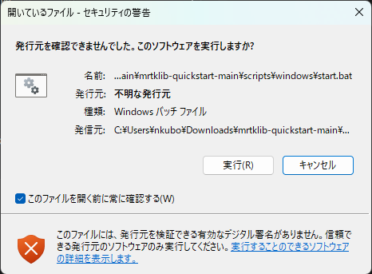

<!-- Windows: how to run start.bat, getting past SmartScreen. -->

## Downloading mrtklib-quickstart {#sec-win-quickstart-download}

Go to [https://github.com/h-shiono/mrtklib-quickstart](https://github.com/h-shiono/mrtklib-quickstart) and download `mrtklib-quickstart` via `<> Code` > `Download ZIP`.
After downloading, extract `mrtklib-quickstart-main.zip` to a folder of your choice.


::: {.callout-note}
If you have git available, cloning the repository with `git clone` also works.
```bash
git clone git@github.com:h-shiono/mrtklib-quickstart.git
```
:::

## Running MRTKLIB {#sec-win-mrtklib-run}

### Pre-run checklist {#sec-win-mrtklib-run-precheck}

Before running, be sure to check the following.

1. **Connect the receiver and antenna**
2. **Connect the receiver via USB**
3. **Start Docker Desktop**
    - If the logged-in user and the administrator user are different → [Run Docker Desktop as administrator](90-troubleshooting.qmd#sec-troubleshooting-docker-admin)

::: {.callout-note}
To check whether Docker Desktop is running, click the `^` on the taskbar to show the hidden icons.
Hover over the 🐳 icon; if it shows `Docker Desktop Running`, Docker Desktop is running.
:::

### Running the batch file {#sec-win-mrtklib-run-batch}

Double-click `scripts/windows/start.bat` to run it.
When you run it, a security warning like the one below appears; click **Run** to continue.



::: {.callout-note}
Depending on your environment, you may instead see a **Windows protected your PC** screen (Microsoft Defender SmartScreen).
In that case, click **More info**, then click the **Run anyway** button that appears to continue.

`start.bat` is a script provided by this guide. You can check its contents under `scripts/windows/`.
:::

::: {.callout-note}
The batch file performs the following steps.

1. **Check prerequisites**: Checks whether the prerequisites for running MRTKLIB and its web UI are in place.
2. **Configure the receiver**: Configures the mosaic-G5 to receive the QZS L6 signal and output raw measurements.
3. **Attach the USB**: To use the USB device in the Docker container, the USB must be attached from Windows to WSL2 using usbipd, and then device-mounted (passed through) into the Docker container.
4. **Start the Docker container**: Pulls `mrtklib-docker-ui` from Docker Hub and starts it.
5. **Launch the web browser**: Launches the web browser and displays the MRTKLIB Console.
:::

After it runs, the same security warning appears again; click **Run** once more.

The screen then shows **Do you want to allow this app to make changes to your device?**; select **Yes**.

### Checking prerequisites {#sec-win-mrtklib-run-prereq-check}

Confirm that `[OK]` is displayed.

```powershell
==> Starting prerequisite checks
[OK] Administrator privileges
[OK] WSL2 distribution: Ubuntu
[OK] Docker Desktop is running
[OK] Docker Desktop is using the WSL2 backend
[OK] usbipd-win 5.3.0
[OK] mosaic-G5 found at BusId 1-4
[OK] Ports 8080, 2101 are free
[OK] Prerequisite checks passed
```

::: {.callout-note}
If any item does not show `[OK]`, the **missing items are listed together** as shown below, and processing is interrupted.
Follow the displayed `Next step` to resolve the issue, then run `start.bat` again.


```powershell
[ERROR] Prerequisite checks failed (2 problem(s))
  1. Cannot reach the Docker daemon
     Next step: Start Docker Desktop and wait for 'Docker Desktop running'. ...
  2. mosaic-G5 (VID_152A&PID_8231) is not connected
     Next step: Connect the receiver by USB and confirm its driver (RxTools) ...
```
:::

### Configuring the receiver {#sec-win-mrtklib-run-receiver}

Confirm that `[OK]` is displayed.

```powershell
==> Configuring the receiver over COM
[OK] Using receiver COM port COM9
[OK]   setSignalTracking,+QZSL6
[OK]   setSatelliteTracking,all
[OK]   setSBFOutput,Stream1,USB1,Support,sec1
[OK]   setDataInOut,USB1, ,+SBF
[OK]   exeCopyConfigFile,Current,Boot
[OK] Receiver configured and saved to boot configuration
```

### Attaching the USB {#sec-win-mrtklib-run-usb-attach}

Confirm that `[OK]` is displayed.

```powershell
==> Attaching the USB device (mosaic-G5) to WSL
[OK] Found mosaic-G5 at BusId 1-4
==> Binding BusId 1-4 (usbipd bind)
usbipd: info: Device with busid '1-4' was already shared.
==> Attaching BusId 1-4 to WSL (usbipd attach --wsl)
usbipd: info: Using WSL distribution 'Ubuntu' to attach; the device will be available in all WSL 2 distributions.
usbipd: info: Detected networking mode 'nat'.
usbipd: info: Using IP address 172.24.80.1 to reach the host.
[OK] mosaic-G5 attached to WSL (BusId 1-4); both COM ports are now available in WSL
```

### Starting the Docker container {#sec-win-mrtklib-run-container}

Confirm that `[OK]` is displayed.

```powershell
==> Starting the mrtklib-docker-ui container
==> Detecting the SBF serial port in WSL
  /dev/ttyACM0: 4096 bytes, SBF sync '$@' x24
  /dev/ttyACM1: 0 bytes, SBF sync '$@' x0
[OK] SBF stream detected on /dev/ttyACM0
[OK] Passing device: /dev/ttyACM0 -> /dev/ttyACM0 (as seen in the container)
```

::: {.callout-note}
The receiver has two virtual COM ports, and depending on the environment, the one carrying SBF may be either `ttyACM0` or `ttyACM1`.
The batch file passes only the detected port through, always as **`/dev/ttyACM0` inside the container**.
Because of this, the path you set later in the UI is always `ttyACM0`.
:::

### Launching the web browser {#sec-win-mrtklib-run-browser}

Confirm that `[OK]` is displayed.

```powershell
==> docker run (hatognss/mrtklib-docker-ui:0.3.0-alpha)
==> Waiting for the web UI at http://localhost:8080
[OK] Web UI is up; opening http://localhost:8080
```


**start.bat execution screen**

After `[OK] Web UI is up; opening http://localhost:8080` is displayed, the web browser launches and shows the MRTKLIB Console screen.


This completes starting MRTKLIB and the web UI.

## Next steps

- Go to [Using the UI](50-using-ui.qmd)
- If it doesn't work → [Troubleshooting](90-troubleshooting.qmd)
