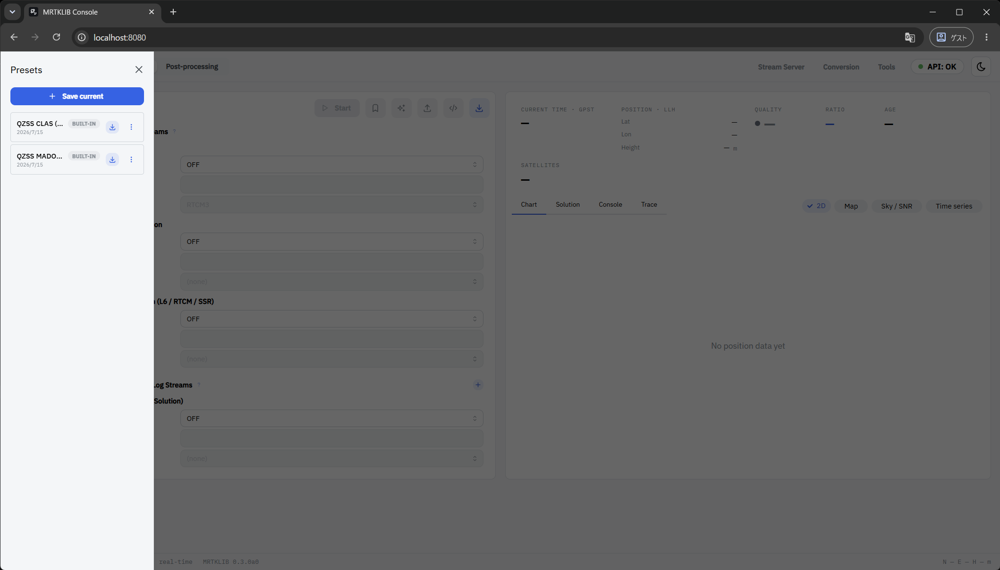
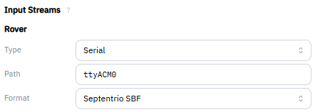
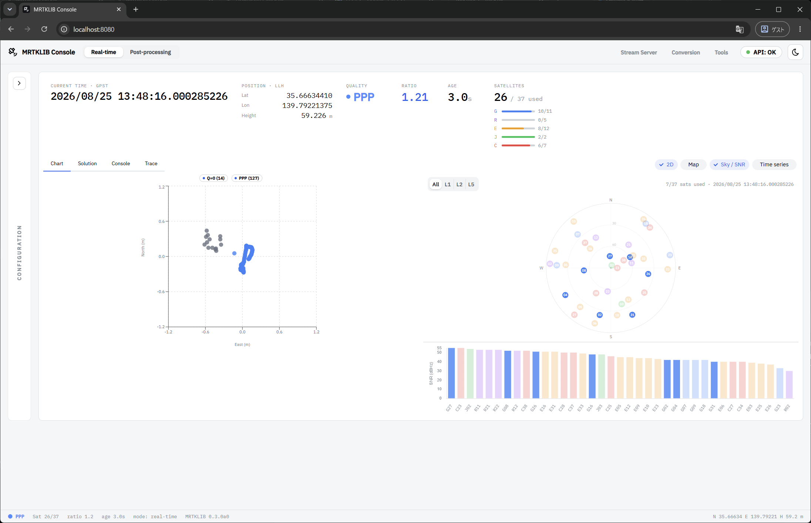
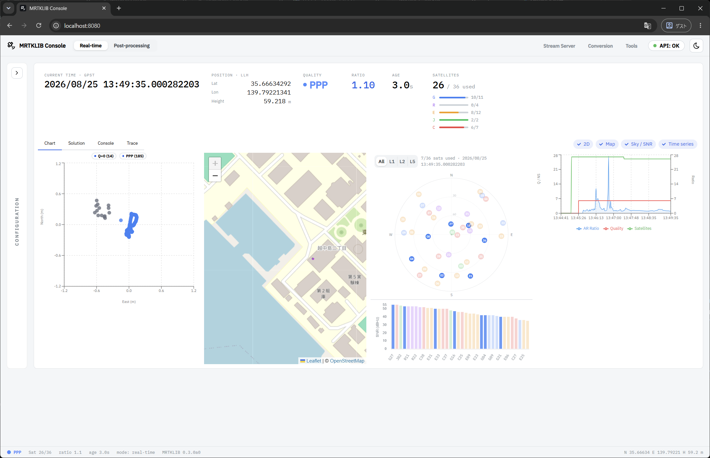
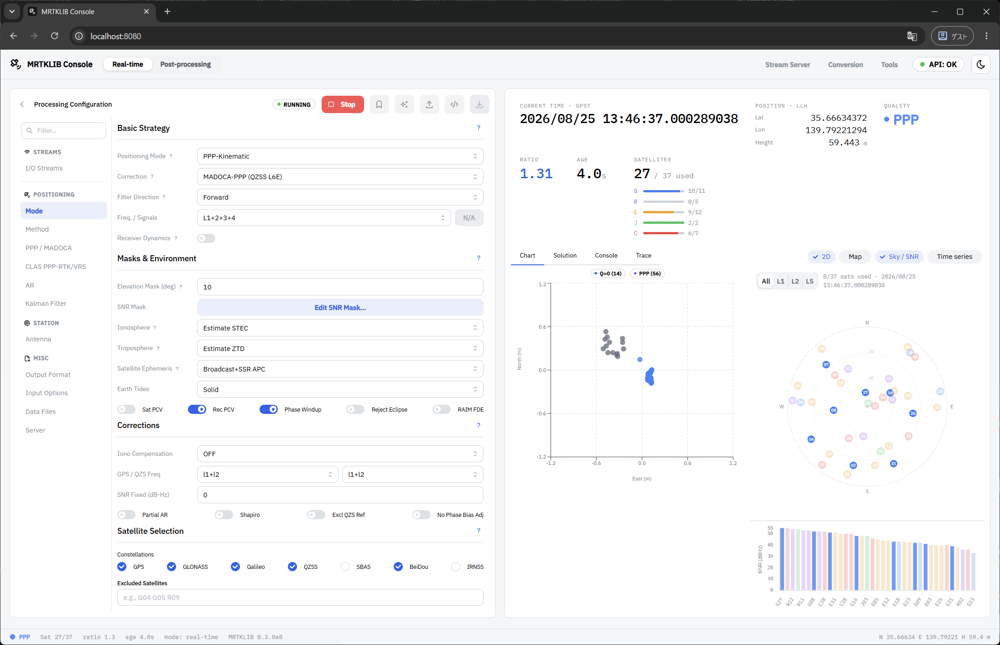
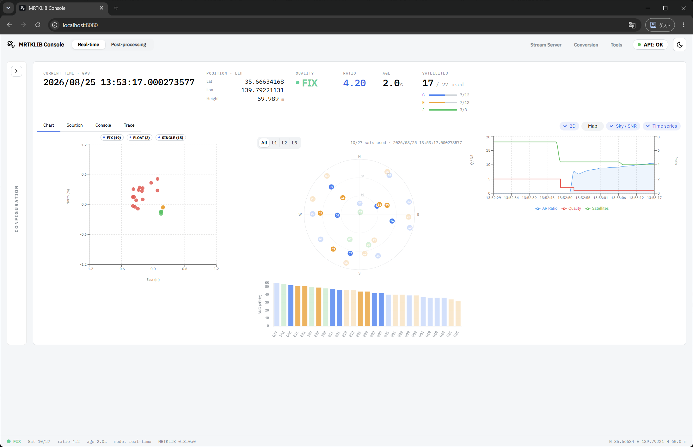

# Using the UI

<!-- Reading the convergence curve (OS-independent, the educational core). -->

## Running real-time PPP positioning {#sec-run-ppp}

### Loading the configuration file {#sec-run-ppp-load-preset}

Click the bookmark icon to open Preset.

Load the preset labeled `QZSS MADOCA (BUILT-IN)`.
You'll be asked `Load preset will overwrite current settings. Continue?`, so click `Load` to load it.

When loading succeeds, `"QZSS MADOCA (PPP-Kinematic)" loaded` is displayed.

### Configuring the rover {#sec-run-ppp-configure-rover}

In `Input Streams` > `Rover`, set the following values.

<figure class="md-table-figure" markdown id="tbl-setup-rover">
<figcaption>Rover settings</figcaption>

| Item | Value |
| --- | --- |
| Type | Serial |
| Path | `ttyACM0` |
| Format | Septentrio SBF |

</figure>

!!! note "Note"

    `Path` is always `ttyACM0`. No matter which of the receiver's virtual COM ports the SBF data comes from, the startup script passes it through so it appears as `/dev/ttyACM0` inside the container, so you don't need to change it depending on your environment.
    The leading `/dev/` is not needed.

### Starting positioning {#sec-run-ppp-start}

Click `Start` to begin positioning.
On the first run, it takes a little time before positioning starts because navigation data must be acquired.

Thanks to wide-area ionospheric correction, you can get a FIX solution within a few minutes under good conditions.

### Switching charts {#sec-run-ppp-chart}

In `Chart`, you can show or hide `2D` / `Map` / `Sky/SNR` / `Time series` by clicking each of them.

### Checking the positioning parameters {#sec-run-ppp-processing-config}

Click each item under `Processing Configuration` to check the details of the positioning parameters.

## This completes the MADOCA-PPP experience 🎉

When you're finished, follow [Shutdown (Windows)](60-stop-windows.md) to stop the container and detach the USB.

!!! tip "Tip"

    If you are running this tutorial within Japan, you can also try CLAS (PPP-RTK) positioning by loading the preset labeled `QZSS CLAS (BUILT-IN)`.
    Try it and see how it differs from MADOCA-PPP.

    

If you want to learn more, refer to the following links.

- [Michibiki Website](https://qzss.go.jp/index.html)
- [Septentrio mosaic-G5 P6](https://www.septentrio.com/ja/products/gnss-receivers/gnss-receiver-modules/mosaic-G5-P6)
    - Evaluation kit
        - 🇯🇵: [4-Frequency Compass & Full RTK Feature Compact Module](https://shop.cqpub.co.jp/hanbai/books/I/I100637.htm)
        - 🇬🇧: [mosaic-go G5 P6 GNSS module receiver evaluation kit](https://shop.septentrio.com/en/shop/mosaic-go-g5-p6-gnss-module-receiver-evaluation-kit)
- MRTKLIB:
    - [MRTKLIB](https://github.com/h-shiono/MRTKLIB)
    - [mrtklib-docker-ui](https://github.com/h-shiono/mrtklib-docker-ui)
    - [mrtklib-quickstart](https://github.com/h-shiono/mrtklib-quickstart)
    - [Zenn (hato.GNSS)](https://zenn.dev/hatognss) (technical articles by the MRTKLIB maintainer)

## If it doesn't work

- [Troubleshooting](90-troubleshooting.md)
