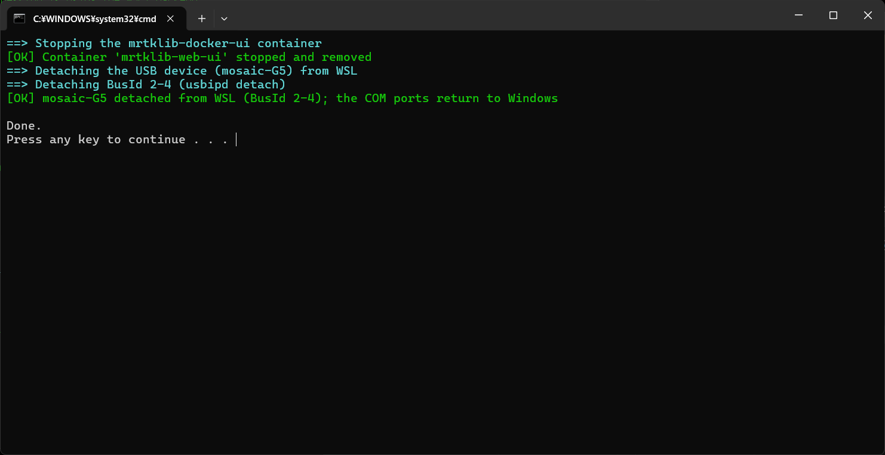

<!-- Windows teardown: stop the container and detach the receiver's USB. -->

When you are done, stop the container and detach the USB.
This stops the container that was running MRTKLIB and the web UI, and frees up the ports.
It also returns control of the receiver to Windows, so you can use it again with RxControl and similar tools.

## Run `stop.bat` {#sec-win-stop-batch}

Double-click `scripts/windows/stop.bat` to run it.



It performs the following steps, the reverse of `start.bat`.

1. **Stop the container**: Stops and removes the `mrtklib-docker-ui` container.
2. **Detach the USB**: Returns the receiver that was attached to WSL back to Windows.

When you run it, it is done once `[OK]` is displayed as shown below.

```powershell
==> Stopping the mrtklib-docker-ui container
[OK] Container 'mrtklib-web-ui' stopped and removed
==> Detaching the USB device (mosaic-G5) from WSL
==> Detaching BusId 1-4 (usbipd detach)
[OK] mosaic-G5 detached from WSL (BusId 1-4); the COM ports return to Windows
```

::: {.callout-note}
`stop.bat` does not require administrator privileges.
Docker Desktop and WSL remain running, so you can run `start.bat` again next time as-is.
:::

This completes the shutdown process.

## Doing it manually {#sec-win-stop-manual}

You can also clean up manually without using `stop.bat`.

### Stop the container {#sec-win-stop-manual-container}

Open Docker Desktop and, under `Containers`, click `Stop` and then `Delete` for `mrtklib-web-ui`.

### Detach the USB {#sec-win-stop-manual-usb-detach}

Running `scripts\windows\detach.bat` returns control of the receiver to Windows.

::: {.callout-note}
If you want to quit Docker Desktop or WSL itself, select `Quit Docker Desktop` from the Docker Desktop menu.
:::
