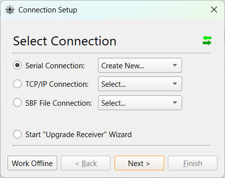
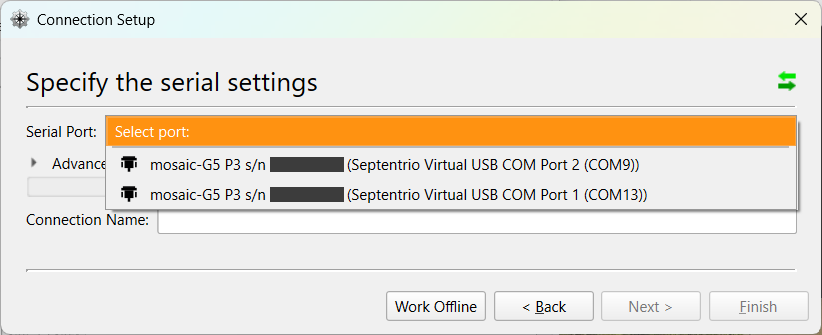
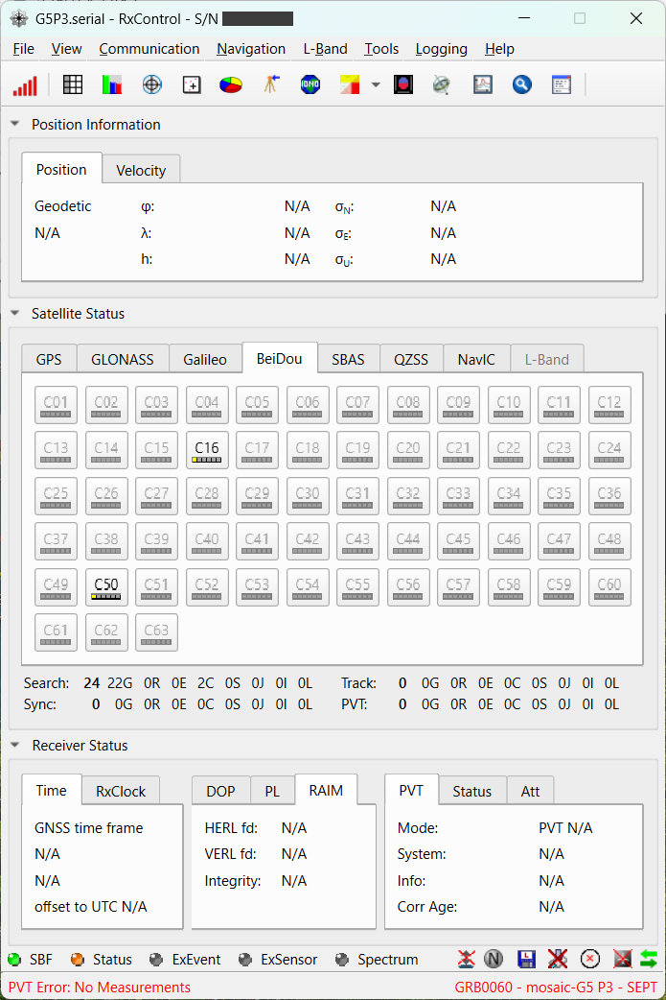
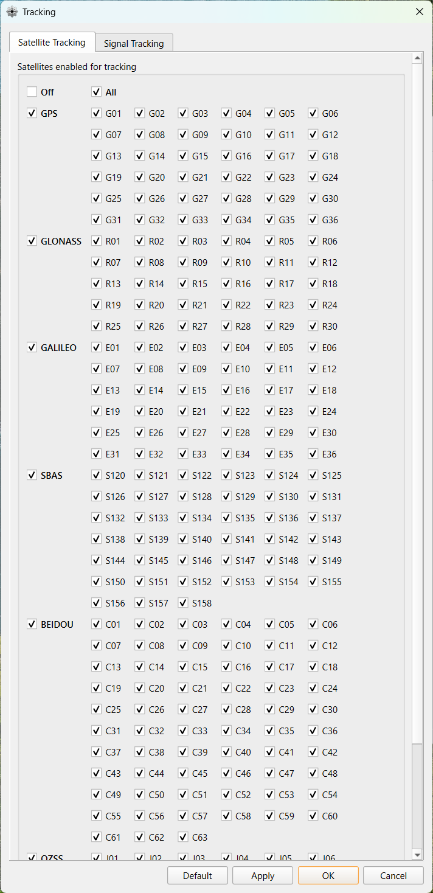
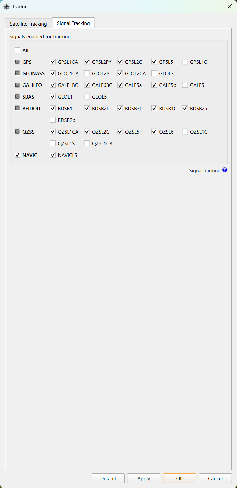
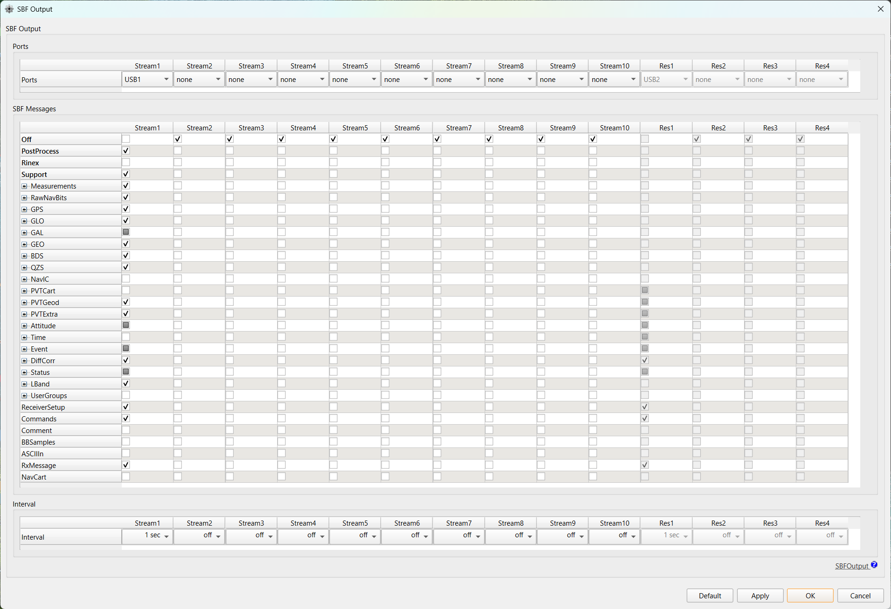
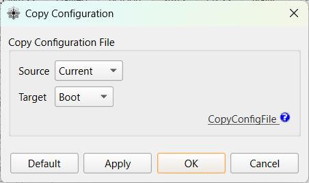

<!-- Appendix: manual receiver configuration via RxControl.
     The start script configures the receiver automatically; this chapter is
     for understanding what it does and for manual fallback / verification.
     Consolidates the former Windows/Linux and macOS receiver-setup chapters. -->

::: {.callout-note}
The startup script (`start.bat`) performs the configuration in this chapter **automatically**. This chapter is a reference for cases where you want to **understand how it works**, or where **the automatic configuration doesn't work and you need to configure / verify it manually**.
:::

## Why this configuration is needed {#sec-appendix-why}

Positioning with MADOCA-PPP applies the **correction data** delivered from QZSS L6 to the **raw measurements** (pseudorange and carrier phase) measured by the receiver itself, and performs the computation.
Since the positioning computation is performed by the MRTKLIB engine inside the container, the receiver must be set to **output both in SBF format**.
The configuration below is the minimum setup for this.

| Setting | Why it's needed |
| --- | --- |
| **Track the QZSL6 signal** | Needed to track and receive the L6 signal. This provides `QZSRawL6E` (MADOCA-PPP: orbit, clock, and bias corrections) and `QZSRawL6D` (wide-area ionospheric correction). |
| **Track all constellations (All)** | Needed to obtain raw measurements for the augmented GPS / GLONASS / Galileo / BeiDou / QZSS constellations. |
| **Output SBF to `USB1`** | The container reads SBF via USB serial. `COM1` is a physical serial port and is not exposed over USB, so select `USB1`. |
| **`Support` message group** | Bundles raw measurements (`MeasEpoch`), navigation data, and `QZSRawL6D/E`, providing the inputs required for PPP. |
| **Save to `Boot`** | Needed so the configuration persists after power-cycling. |

The following are the steps to manually configure the above using the RxControl GUI (common to Windows / Linux; screenshots are from Windows).

## Connecting the receiver (Windows, Linux) {#sec-appendix-connect}

::: {.callout-caution}
Before reading this section, complete the "RxTools" installation ([Windows](20-install-windows.qmd#sec-win-rxtools)) first.
:::

Using a USB cable, connect the receiver to a Windows or Linux PC.
When the connection succeeds, the receiver's PWR LED lights up red.

## Configuring the receiver (Windows, Linux) {#sec-appendix-config}

::: {.callout-note}
In RxControl, the naming of ports differs between dialogs (for example, `Port 2` in the connection setup versus `COM1` in the SBF output setup). This is how Septentrio's tool works. Since this can be confusing, at each step select exactly the port shown in the screenshot.
:::

### Launching RxControl {#sec-appendix-config-rxcontrol}

Launch `RxControl`.

On first launch, the `Connection Setup` dialog appears.
Select `Serial Connection` > `Create New...`, then click `Next >`.

Two COM ports for the connected receiver are shown under `Serial Port`; select `Port 2`.
Set any name you like for `Connection Name`, then click `Finish`.

When the connection succeeds, the `RxControl` main screen appears.

### Configuring satellite and signal tracking {#sec-appendix-config-tracking}

Open `Navigation` > `Advanced User Settings` > `Tracking...`.

On the `Satellite Tracking` tab, check `All`.

::: {.callout-note}
MADOCA-PPP supports `GPS`, `GLONASS`, `Galileo`, `BDS`, and `QZSS`.
:::

Next, on the `Signal Tracking` tab, check `QZSL6`.

::: {.callout-note}
Using MADOCA-PPP requires `QZSRawL6E`.
Here, since we perform PPP-AR/Iono positioning using the wide-area ionospheric correction that is under technical demonstration, `QZSRawL6D` is also required.
Checking `QZSL6` enables reception of `QZSRawL6D` and `QZSRawL6E`.
:::

Finally, click `Apply` > `OK` to apply the configuration.

### Configuring SBF output {#sec-appendix-config-sbf-output}

Open `Communication` > `Output Settings` > `SBF Output...`.

- Set `Ports` for `Stream 1` to `USB1`, and check `Support` under `SBF Messages`.
- Set `Interval` to `1 sec`.

::: {.callout-important}
Be sure to select `USB1` as the output destination. `COM1` is a physical serial port, so SBF will not reach the container over USB.
:::

Finally, click `Apply` > `OK` to apply the configuration.

### Saving the receiver configuration {#sec-appendix-config-save}

Open `File` > `Copy Configuration`.

Set `Source` to `Current` and `Target` to `Boot`, then click `Apply` > `OK` to apply the configuration.

This completes the receiver configuration.

## Configuring the receiver (macOS) {#sec-appendix-config-macos}

TBD
