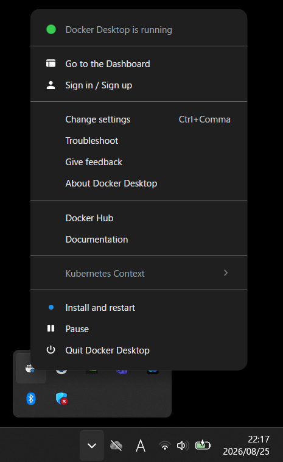
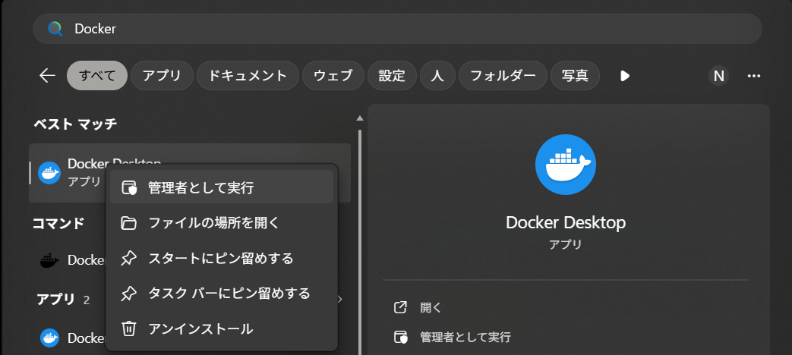

# Troubleshooting

<!-- Organized by symptom, roughly in the order a user reaches them during setup.
     Windows-first; macOS/Linux specifics are TODO. -->

If things are not working, first check the error message that was displayed (the `[ERROR]` line and the `Next step:` hint). Below are remedies organized by symptom.

## Cannot install usbipd-win with winget {#sec-troubleshooting-winget}

If you cannot proceed when running `winget install ... dorssel.usbipd-win`, because of an error like the following.

```
Failed in attempting to update the source: winget
0x8a15000f : Data required by the source is missing
No package found matching input criteria.
```

This happens when winget's package source (the package list index) has not been initialized, or is not registered for the current user profile. Resolve it in the following order.

1. Reset the source and fetch it again.

    ```powershell
    winget source reset --force
    winget source update
    ```

2. Re-run the install, automatically accepting the terms of use.

    ```powershell
    winget install --interactive --exact dorssel.usbipd-win --accept-source-agreements --accept-package-agreements
    ```

If this does not resolve the issue, install manually without winget. Download the latest `usbipd-win_x.x.x.msi` from [usbipd-win's GitHub Releases](https://github.com/dorssel/usbipd-win/releases/latest) and double-click it to install.

!!! note "Note"

    This error also occurs when the winget source is not registered for the user profile that ran winget. In this case too, the manual install (`.msi`) above is the reliable option.

## usbipd attach fails (no WSL distribution) {#sec-troubleshooting-usbipd-attach}

If you see `usbipd attach failed`, or the following message.

```
usbipd: error: There is no WSL 2 distribution running; ...
```

`usbipd attach --wsl` requires an actual WSL2 distribution (Ubuntu, in this guide). Docker Desktop's internal distribution (`docker-desktop`) is not recognized as an attach target.

- **Install Ubuntu** — If it is not installed yet, follow the steps in [Install (Windows)](20-install-windows.md#sec-win-wsl2-install) to run `wsl --install -d Ubuntu` and complete the initial setup (username and password).
- **Check that it is running on WSL2** — Run the following command and confirm that `Ubuntu` is listed with `VERSION` set to `2`.

    ```powershell
    wsl -l -v
    ```

## Cannot run due to a security warning {#sec-troubleshooting-security-warning}

- **"Open File - Security Warning"** — Click **Run**.
- **"Windows protected your PC" (SmartScreen)** — Click **More info**; a **Run anyway** button appears, so click that. See [Run (Windows)](30-run-windows.md) for details.

## Administrator privileges error (usbipd bind failed) {#sec-troubleshooting-permission-error}

If you see `usbipd bind failed` or a message that administrator privileges are required.

- `start.bat` requests administrator privileges when it runs. For the prompt "Do you want to allow this app to make changes to your device?", select **Yes**. If you accidentally selected "No", run `start.bat` again.

## Receiver (COM port) not found {#sec-troubleshooting-com-not-found}

If you see `No Septentrio COM port found` or `mosaic-G5 ... is not connected`.

- **Is the receiver connected via USB?** — Reseat the cable and confirm that the receiver's `PWR` LED is lit red.
- **Is RxTools installed?** — The driver that lets the receiver be recognized as a USB serial device is provided by RxTools. If it is not installed, see [Install (Windows)](20-install-windows.md).
- **Is another application, such as RxControl, holding the COM port?** — Having RxControl open occupies the COM port. Close it and try again.
- **Has it already been attached to WSL?** — Once attached to WSL, the COM port is no longer visible from Windows. Detach it with `scripts\windows\detach.bat` and try again.

!!! tip "Tip"

    If two `Septentrio Virtual USB COM Port` entries appear under "Ports (COM & LPT)" in Device Manager, Windows can recognize the receiver.

    {#fig-device-manager}
    *Checking the COM port using Device Manager*{ .figure-caption }

## SBF stream not detected {#sec-troubleshooting-sbf-not-detected}

If you see `No SBF stream detected on the receiver's ports`, or both ports show `0 bytes` during detection.

- **Is the SBF output set to `USB1`?** — If output is going to `COM1` (the physical serial port), it will not reach the USB side. `start.bat` normally configures this automatically, but if you have overridden it with a manual configuration, check [Appendix: Receiver Setup](80-appendix-receiver-setup.md).
- **Is `QZSL6` tracking enabled?** — Check whether the correction data (`QZSRawL6D/E`) is being output; see the same appendix.
- **You see `permission denied for user ...`** — Serial devices inside WSL (`/dev/ttyACM*`) can only be read by root or a user in the `dialout` group, and whether you are in `dialout` depends on the Ubuntu version and setup method. `start.bat` runs detection with root privileges (`wsl -u root`), so this error does not occur there, but it can appear if you run the detection script manually. To fix this permanently, run the following in the Ubuntu shell.

    ```bash
    sudo usermod -aG dialout $USER
    ```

    After running it, execute `wsl --shutdown` in PowerShell to apply the group change, then try again.

!!! note "Note"

    The SBF `Support` group is output even when positioning has not been achieved. If both ports show `0 bytes`, suspect the output port configuration rather than "satellites not visible".

!!! tip "Tip"

    You can check directly whether data from the receiver is reaching WSL with the following command (it reads both `ttyACM` ports in turn). The hex bytes `24 40` are the SBF sync bytes `$@`. Which port SBF appears on varies by environment, so do not judge based on checking only one. Also, if the container is running, it will be reading the same port and competing for the data, so stop it with `docker stop mrtklib-web-ui` before checking.

    ```powershell
    wsl -u root bash -c 'for p in /dev/ttyACM*; do echo $p:; timeout 3 cat $p | head -c 64 | od -An -tx1; done'
    ```

## Docker Desktop is not running on the WSL2 backend {#sec-troubleshooting-backend}

If either of the following errors is shown when running `docker run`.

```
docker: Error response from daemon: error gathering device information while adding custom device "/dev/ttyACM0": no such file or directory
```

```
docker: Error response from daemon: ... workspace: Access is denied.
```

If Docker Desktop is running on the **Hyper-V backend**, containers run on a virtual machine separate from WSL2. Because of this, the container cannot see the receiver device attached to WSL (Ubuntu) (`no such file or directory`), and mounting Windows folders can also be denied access (`Access is denied`).

First, check whether `docker-desktop` is registered with the following command.

```powershell
wsl -l -v
```

If `docker-desktop` is not listed, it is running on the Hyper-V backend.
Follow the steps in [Install (Windows)](20-install-windows.md#sec-win-docker-backend) to enable `Use the WSL 2 based engine`, turn on `Ubuntu` under `WSL integration`, and then run `start.bat` again.

!!! note "Note"

    You can check whether the usbipd attach itself succeeded with the following command.
    If `/dev/ttyACM0` and `/dev/ttyACM1` are listed, the devices have reached the WSL side successfully.

    ```powershell
    wsl ls /dev/ttyACM*
    ```

## Container does not start {#sec-troubleshooting-container-not-starting}

If you see `docker run failed` or `docker command not found`, or startup does not proceed.

- **Is Docker Desktop running?** — Hover over the 🐳 icon in the taskbar's hidden icons and confirm `Docker Desktop running`. If it is not running, start Docker Desktop and try again.
    - If the logged-in user and the administrator user are different → [Run Docker Desktop as administrator](#sec-troubleshooting-docker-admin)
- **You see `... workspace: Access is denied` or `... no such file or directory`** — This often happens when Docker Desktop is not running on the WSL2 backend. See [Docker Desktop is not running on the WSL2 backend](#sec-troubleshooting-backend).
- **`docker command not found`** — Docker Desktop itself is not installed. See [Install (Windows)](20-install-windows.md).
- **Port 8080 / 2101 is in use** — If an existing container or another application is using these ports, startup fails. See [Cannot start because a port is in use](#sec-troubleshooting-port-in-use) for details.
- **Pulling the image is slow / fails** — The first run takes a few minutes to download the image. Check your network connection and try again after a while.
- **It stops right after starting** — Check the logs with the following command.

    ```powershell
    docker logs mrtklib-web-ui
    ```

## Cannot start because a port is in use {#sec-troubleshooting-port-in-use}

The container uses two ports. If either one is occupied, `docker run` fails and the container does not start.

| Port | Purpose |
| --- | --- |
| `8080` | web UI (MRTKLIB Console) |
| `2101` | TCP/IP output of the positioning solution ([Appendix: Solution Output](81-appendix-output.md)) |

!!! note "Note"

    `2101` is reserved at startup even if you are not using TCP/IP output. Even if you do not plan to use the output feature, startup fails if this port is occupied.

The following error is displayed.

```
docker: Error response from daemon: Ports are not available: exposing port TCP 0.0.0.0:2101 -> 127.0.0.1:0: listen tcp 0.0.0.0:2101: bind: Only one usage of each socket address ... is normally permitted.
```

### A previous container is still present {#sec-troubleshooting-port-stale-container}

This is the most common cause. Remove it with the following command, then run `start.bat` again.

```powershell
docker rm -f mrtklib-web-ui
```

### Another application is using the port {#sec-troubleshooting-port-other-app}

Find the PID of the process using the port with the following command.

```powershell
netstat -ano | findstr :2101
```

The rightmost column of the displayed line is the PID. You can check the process name with the following command.

```powershell
tasklist /FI "PID eq 1234"
```

If you cannot close that application, see [Change the port in use](#sec-troubleshooting-port-change).

### Windows has reserved the port {#sec-troubleshooting-port-reserved}

If startup fails even though `netstat` shows nothing, and you see an error like the following, Windows (Hyper-V / WinNAT) may have reserved the port range.

```
bind: An attempt was made to access a socket in a way forbidden by its access permissions.
```

You can check the reserved range with the following command. Run it in an administrator PowerShell ([Run PowerShell as administrator](20-install-windows.md#sec-win-wsl2-powershell)).

```powershell
netsh int ipv4 show excludedportrange protocol=tcp
```

If the displayed range includes `8080` or `2101`, restarting WinNAT may release the reservation.

```powershell
net stop winnat
net start winnat
```

If it is not released, see [Change the port in use](#sec-troubleshooting-port-change).

### Change the port in use {#sec-troubleshooting-port-change}

Rewrite the following values, near the top of `scripts\windows\lib\common.ps1`, to unused port numbers.

```powershell
$HostPort      = 8080   # web UI (MRTKLIB Console)
$OutPort       = 2101   # TCP/IP output of the solution
```

!!! note "Note"

    These two values are defined in one place in `common.ps1` and are referenced by both the prerequisite checks and the container startup. You do not need to edit any other file.

!!! danger "Important"

    If you change `$OutPort`, also match the TCP Server port number set in `Output & Log Streams` in the UI to the same value. If the numbers do not match, external connections will not work.

## Run Docker Desktop as administrator {#sec-troubleshooting-docker-admin}

If the logged-in user and the administrator user are different, **you need to run Docker Desktop as administrator.**
If Docker Desktop is already running, first stop it using [the steps below](#sec-troubleshooting-docker-admin-stop).

### Stopping Docker Desktop {#sec-troubleshooting-docker-admin-stop}

Show the hidden icons from the `^` on the taskbar.
Hover over the 🐳 icon, right-click, and click `Quit Docker Desktop` to exit.



### Starting Docker Desktop {#sec-troubleshooting-docker-admin-start}

Search for `Docker Desktop` in the Windows Start menu, right-click it, and click **Run as administrator**.



If you relaunched it as administrator, note that Docker Desktop settings are saved per user, so go through **[Configure the Docker Desktop backend](20-install-windows.md#sec-win-docker-backend)** again.

## UI does not open in the browser {#sec-troubleshooting-browser-not-opening}

- **Fetching the image takes time on the first run** — Even if the startup wait times out, the container may still be running. Wait a moment, then manually open [http://localhost:8080](http://localhost:8080).
- **Check whether the container is running** — Check whether `mrtklib-web-ui` shows `Up` with the following command. If it is not listed, run `start.bat` again.

    ```powershell
    docker ps
    ```

    When it is running
    ```powershell
    CONTAINER ID   IMAGE                                    COMMAND                   CREATED          STATUS                    PORTS                                         NAMES
    afa58c127340   hatognss/mrtklib-docker-ui:0.3.0-alpha   "uvicorn mrtklib_web…"   47 seconds ago   Up 46 seconds (healthy)   0.0.0.0:8080->8000/tcp, [::]:8080->8000/tcp   mrtklib-web-ui
    ```

    When it is not running
    ```powershell
    CONTAINER ID   IMAGE     COMMAND   CREATED   STATUS    PORTS     NAMES
    ```

## Positioning does not start / does not reach FIX {#sec-troubleshooting-no-fix}

- **Is `Path` in the UI correct?** — Set it to `ttyACM0` (no leading `/dev/` needed). The startup script always maps the port that SBF is on to `/dev/ttyACM0` inside the container, so this value is fixed regardless of environment ([Using the UI](50-using-ui.md)).
- **Is the antenna obstructed?** — Satellites cannot be acquired indoors or in places where the sky is blocked. Place the antenna somewhere with a clear view of the sky.
- **Acquiring navigation data takes time on the first run** — Wait a few minutes for positioning to start.
- **Is QZSS L6 being received?** — MADOCA-PPP requires the QZSS L6 correction data. Check QZS visibility (elevation) ([GNSS View](https://app.qzss.go.jp/GNSSView/gnssview.html)).

<!-- TODO: Add macOS / Linux specific symptoms (driver, /dev path, permissions) as subsections. -->
