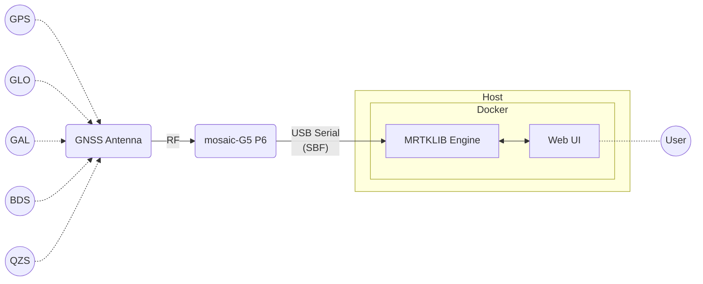

# 概要

<!-- What we do and the big picture (OS-independent). -->

## 本ガイドの目的 {#sec-purpose}

本ガイドでは、Septentrio mosaic-G5 受信機と MRTKLIB を使って、MADOCA-PPP による Real-time PPP 測位を体験することを目的としています。

## 始める前に {#sec-prerequisites}

### 実行環境の確認 {#sec-prerequisites-environment}

本ガイドでは、以下の環境での動作を確認しています。

- Windows 11 25H2 (AMD64)
- macOS Tahoe 26.5.2 (Apple Silicon)
- Ubuntu 24.04 (AMD64)

### 受信機・アンテナ・ケーブルの準備 {#sec-prerequisites-hardware}

本ガイドでは、以下の受信機・アンテナ・ケーブルを使用することを前提としています。

- 受信機: Septentrio mosaic-G5 P6 evaluation kit
- アンテナ: フルバンド GNSS アンテナ (例: ヨコオ YOZ-52728)
- USB ケーブル: 受信機をホスト PC に接続するための USB ケーブル

!!! note "ノート"

    受信機は mosaic-G5 P3 あるいは P8 でも同様の手順にて体験いただけます。

## 全体像 {#sec-big-picture}

下図は本ガイドの全体像を示したものです。
フルバンド GNSS アンテナと mosaic-G5 にて GPS, GLONASS, Galileo, BeiDou, QZSS の信号を受信し、その Raw データを Docker 上の MRTKLIB で PPP 測位し、Web UI を通して結果を表示します。

## 次のステップ

- 仕組みを知る → [コンセプト](10-concepts.md)
- とにかく動かしたい
    - はじめて起動する → OS 別のインストール
    （[Windows](20-install-windows.md) / [macOS](21-install-macos.md) / [Linux](22-install-linux.md)）
    - 2回目以降 → OS 別の起動
    （[Windows](30-run-windows.md) / [macOS](31-run-macos.md) / [Linux](32-run-linux.md)）
