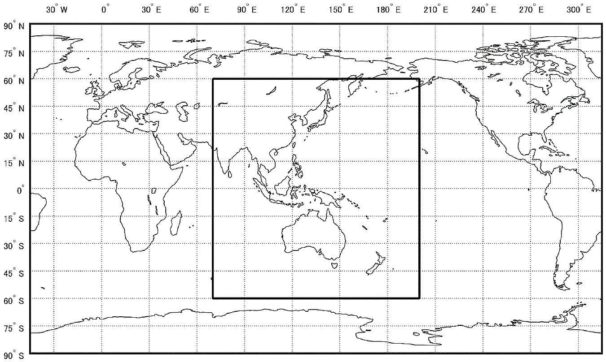
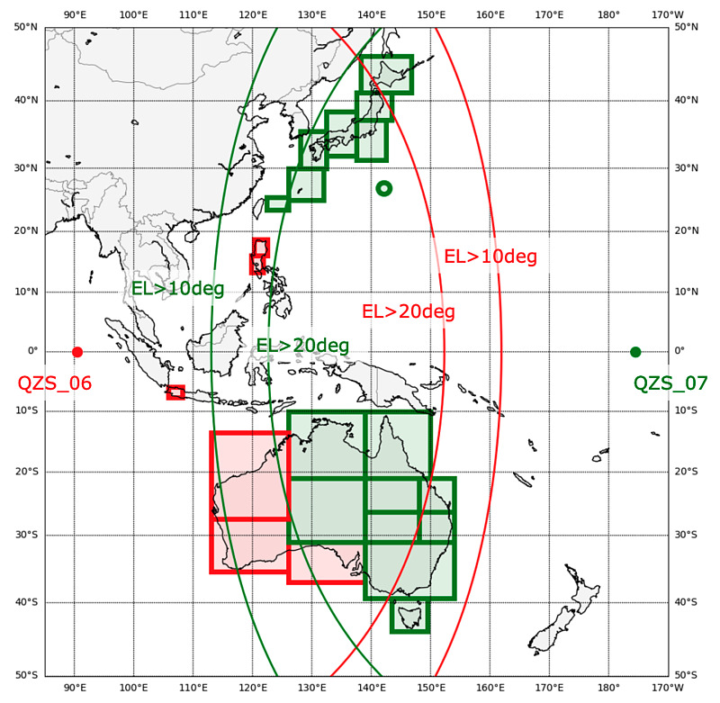

<!-- The roles of MADOCA-PPP / raw / CON (OS-independent, the thick chapter). -->

## MADOCA-PPP とは

MADOCA-PPP (Multi-GNSS Advanced Orbit and Clock Augmentation - Precise Point Positioning) は、準天頂衛星システム（QZSS）の L6 信号から配信される補正情報の一つです。
仰角10度以上の QZS が1機以上、仰角10度以上の補強対象衛星が20機以上見える範囲で利用可能です。

**MADOCA-PPP サービス範囲[^1]**

[^1]: 高精度測位補強サービス（MADOCA-PPP）, QSS, https://qzss.go.jp/technical/system/madoca.html, 2026-07-15 アクセス 

MADOCA-PPP の補正情報を用いることで、精密単独測位（Precise Point Positioning）を行うことができ、センチメーター級の測位精度が得られます。
サービスは L6E 信号から配信され、衛星の軌道・クロック・バイアス補正が含まれています。
補強対象となる GNSS は、GPS, GLONASS, Galileo, BeiDou, QZSS です。
用いるアルゴリズムにもよりますが、数十センチ～センチメータ級の精度が得られるまで30分程度要します。

2025年より、準天頂衛星の7機体制の整備がはじまりました。
これに伴い、QZS6, QZS7 の L6D 信号から広域電離圏補正情報が配信されることになりました。
従来の L6E 信号と併せて用いることで、収束時間を10分程度まで縮めることが可能になりました。

**MADOCA-PPP 広域電離層情報 サービス範囲[^2]**

本ガイドを通して、この MADOCA-PPP 広域電離圏補正サービスを体験していただきます。

[^2]: MADOCA-PPP広域電離層情報カバーエリアの更新, 高橋賢, https://s-taka.org/madoca-ionosphere-update/, 2026-07-15 アクセス

## 2 つのデータ系統：raw と CON

PPP は 2 種類のデータを突き合わせて計算します。

- **raw（生観測）** — 受信機が測定した搬送波位相・擬似距離などの生データ。PPP の「**測る**」側です。
- **CON（補正）** — QZSS L6 から届く軌道・クロック・電離圏などの補正情報。PPP の「**正す**」側です。

コンテナ内の MRTKLIB エンジンは、この 2 つを突き合わせて精密測位を行います。
本ガイドの構成では、両方を 1 本の SBF ストリーム（`Support` メッセージ群）にまとめ、受信機の `USB1` ポートから出力します。
受信機を USB で接続すると WSL 側に 2 つのシリアルポート（`/dev/ttyACM0` / `/dev/ttyACM1`）が現れますが、SBF が流れているのはそのうち一方です。起動スクリプトは中身を見て自動で判別します。

受信機側の具体的な設定は「[付録：受信機の手動設定](80-appendix-receiver-setup.qmd)」を参照してください（通常は `start.bat` が自動で行います）。

## 収束の仕組み

TODO:「収束カーブ」章につながる概念説明。
