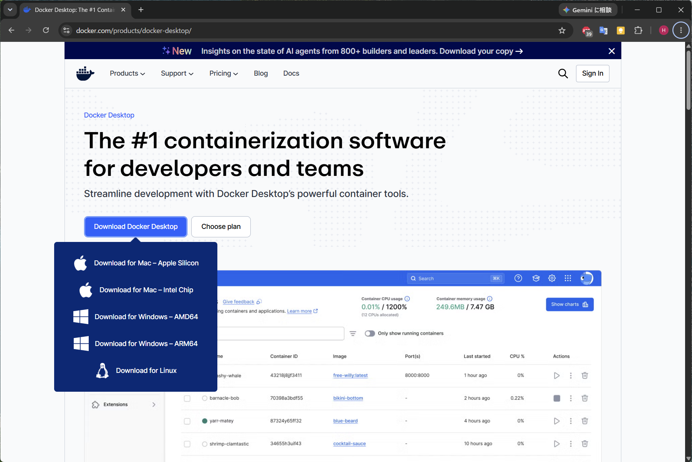
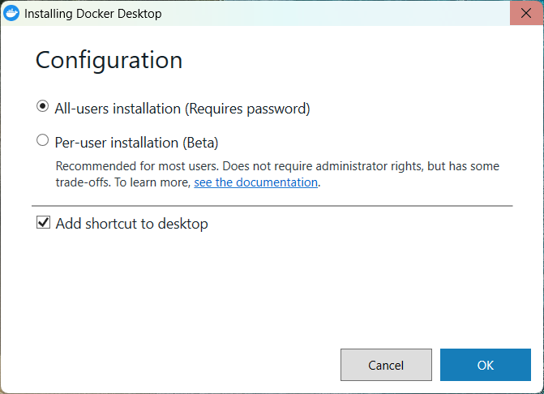
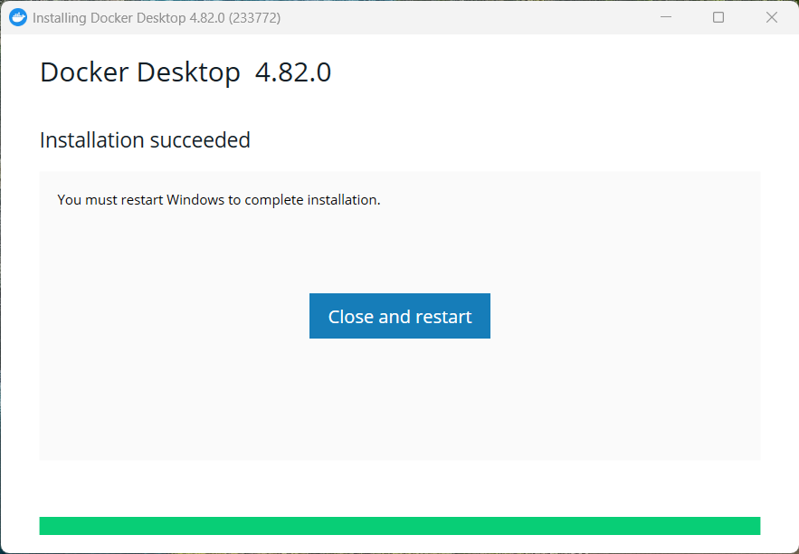
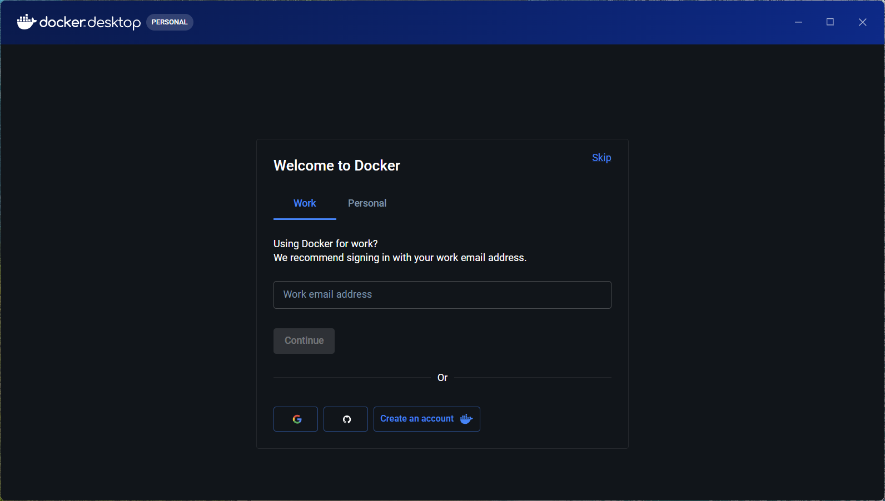
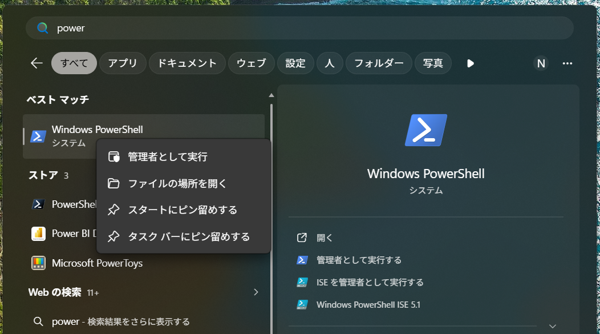
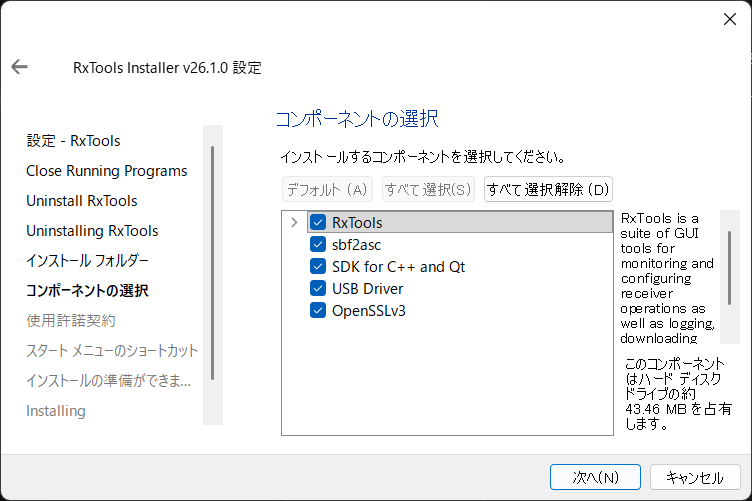
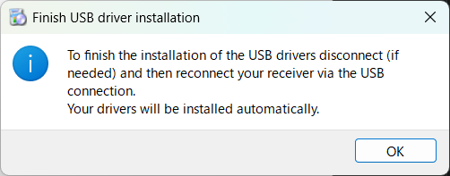

<!-- Installing Docker Desktop and prerequisites on Windows. -->

## Docker Desktop

### Docker Desktop のダウンロード

[https://www.docker.com/products/docker-desktop/](https://www.docker.com/products/docker-desktop/) より、`Docker Desktop for Windows - AMD64` をダウンロードします。



### Docker Desktop のインストール

ダウンロードした `Docker Desktop Installer` を実行します。



必要に応じて、 `All-users installation` か `Per-user installation` を選択します。
Desktop にショートカットを作成する場合は `Add shortcut to desktop` にチェックを入れます。

`All-users installation` を選択した場合、管理者権限を要求されます。
画面に「このアプリがデバイスに変更を加えることを許可しますか？」と表示されるので、「はい」を選択します。

インストールが完了すると、以下の画面が表示されるので、`Close and restart` をクリックして PC を再起動します。



### Docker Desktop の初回起動

再起動後、Docker Desktop を起動します。
初回起動時にサービス利用規約の同意を求められるので、内容を確認して「Accept」をクリックします。


Docker Desktop が起動すると、`Welcome to Docker` 画面が表示されます。
今回は `Skip` をクリックし、スキップします。



以上にて、Docker Desktop のインストールは完了です。

## WSL2

次に、Windows Subsystem for Linux 2 (WSL2) を有効化します。

### PowerShell を管理者権限で起動

Windows のスタートメニューから `PowerShell` を検索し、右クリックして「管理者として実行」をクリックします。



画面に「このアプリがデバイスに変更を加えることを許可しますか？」と表示されるので、「はい」を選択します。

### WSL2 のインストール

以下のコマンドを入力して、コンピューターを再起動します。

```ps
wsl --install --no-distribution
```

このコマンドにより、WSL 機能が有効になります。

::: {.callout-note}
Docker Desktop のバックエンドとして WSL2 を使用する場合、ディストリビューションのインストールは不要です。
:::

以上にて、WSL2 の有効化は完了です。

## usbipd-win のインストール

Windows パッケージ マネージャー (winget) を使用して usbipd-win をインストールします。

```ps
winget install --interactive --exact dorssel.usbipd-win
```

::: {.callout-note}
`--interactive` を省略すると、コンピューターが直ちに再起動する可能性があります。
:::

以上にて、usbipd-win の導入は完了です。

## RxTools

### RxTools のダウンロード

[https://www.septentrio.com/en/products/gps-gnss-receiver-software/rxtools#resources](https://www.septentrio.com/en/products/gps-gnss-receiver-software/rxtools#resources) より、`RxTools v26.1.0 Installer (Windows 64-bit)` をダウンロードします。

::: {.callout-note}
ダウンロードの際に、以下の情報を入力する必要があります。

メールアドレス、氏名、国、所属、業種
:::

### RxTools のインストール

ダウンロードした `RxTools v26.1.0 Installer (Windows 64-bit)` を実行し、インストーラの指示に従ってインストールを進めます。

「コンポーネントの選択」画面では、全てにチェックを入れたままにして、「次へ」をクリックします。



進んでいくと、「インストールの準備ができました」と表示されるので、「インストール」をクリックします。

画面に「このアプリがデバイスに変更を加えることを許可しますか？」と表示されるので、「はい」を選択します。

インストールが進むと以下のポップアップが表示されるので、「OK」をクリックします。



::: {.callout-note}
RxTools のインストーラは受信機設定ツール以外に USB Driver を含んでいます。
このドライバによって USB シリアルとして認識させることができるようになります。

ドライバは受信機を USB 接続した際に自動でインストールされます。
:::

以上にて、RxTools のインストールは完了です。


## 次のステップ

- [起動（Windows）](30-run-windows.qmd) へ
- うまくいかない場合 → [トラブルシューティング](90-troubleshooting.qmd)
