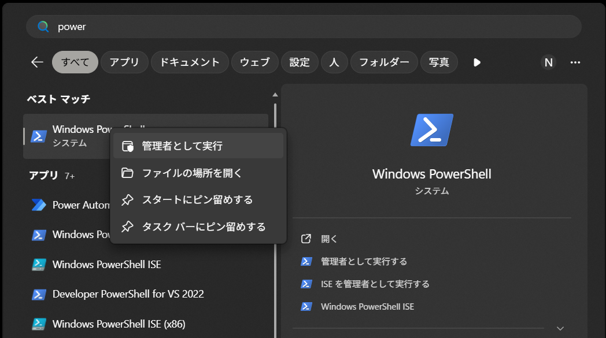
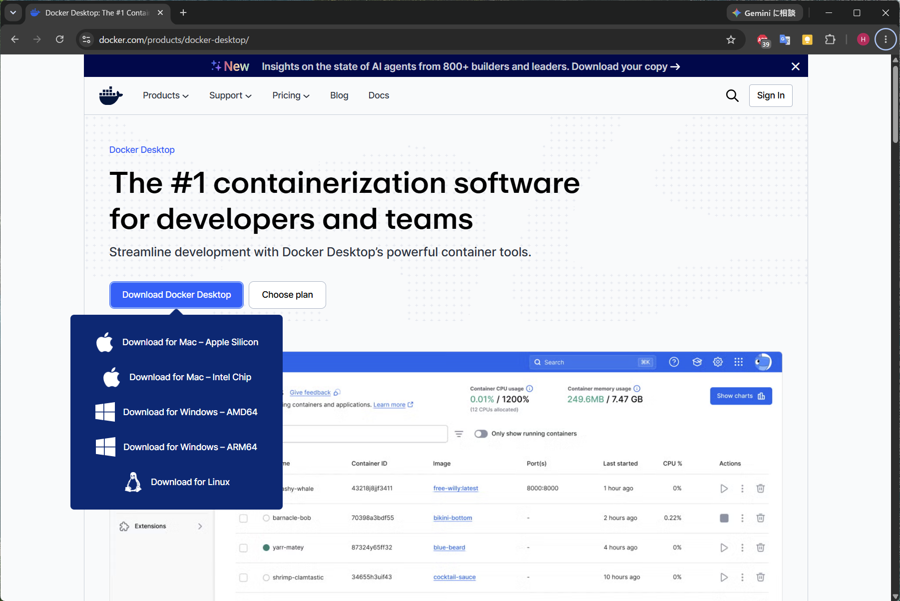
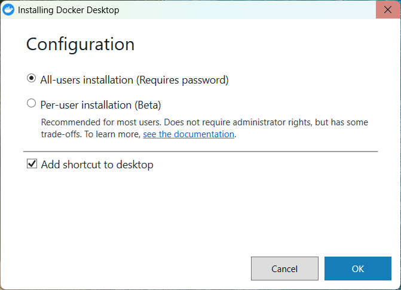
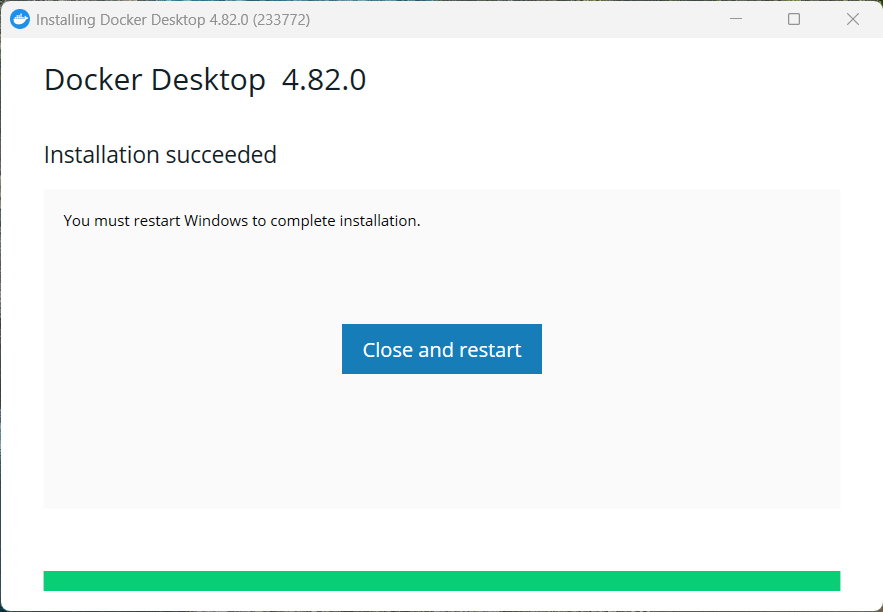
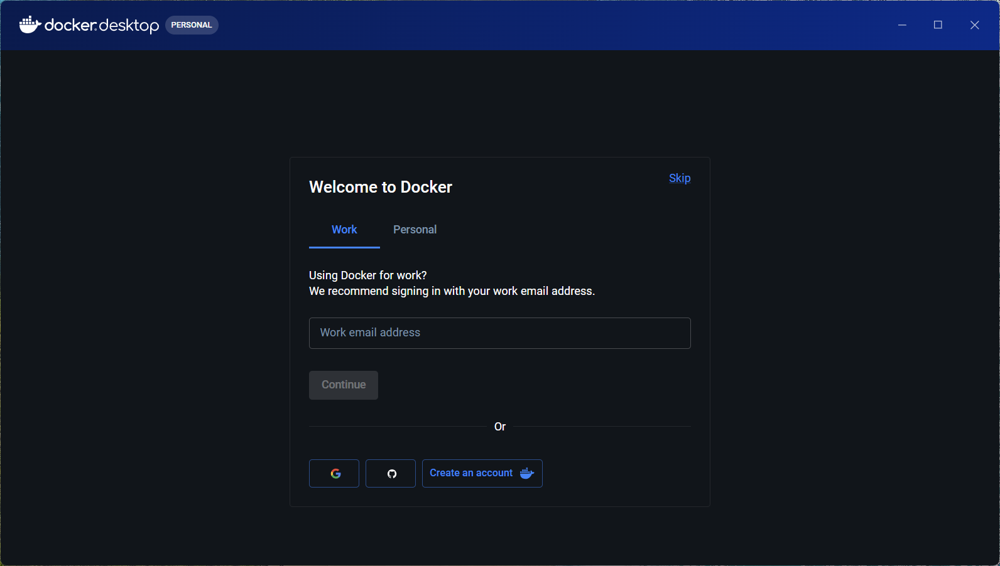
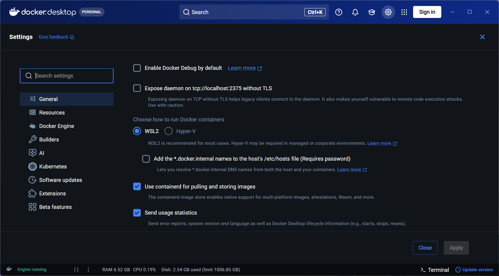
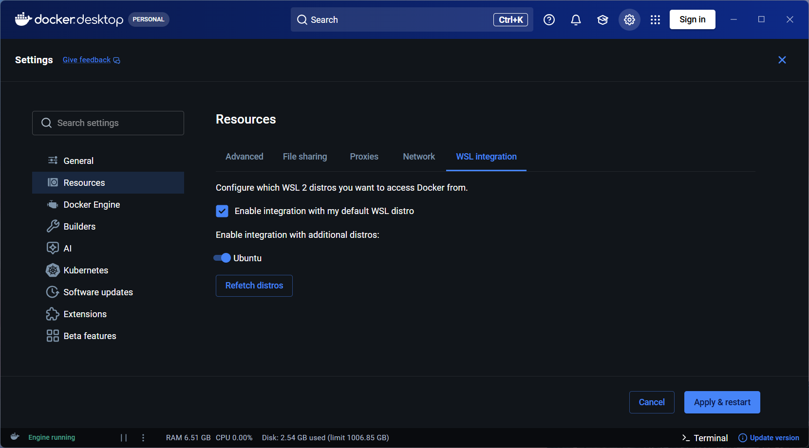
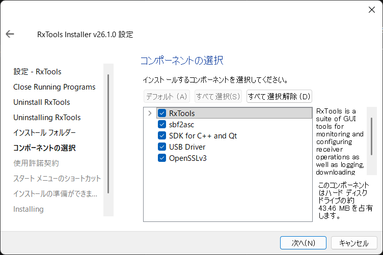
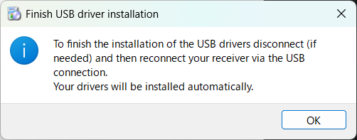

<!-- Installing Docker Desktop and prerequisites on Windows. -->

## WSL2 {#sec-win-wsl2}

Windows Subsystem for Linux 2 (WSL2) を有効化し、Ubuntu ディストリビューションをインストールします。

### PowerShell を管理者権限で起動 {#sec-win-wsl2-powershell}

Windows のスタートメニューから `PowerShell` を検索し、右クリックして「管理者として実行」をクリックします。



画面に「このアプリがデバイスに変更を加えることを許可しますか？」と表示されるので、「はい」を選択します。

### WSL2 と Ubuntu のインストール {#sec-win-wsl2-install}

以下のコマンドを入力して、WSL2 と Ubuntu ディストリビューションをインストールします。

```powershell
wsl --install -d Ubuntu
```

インストールが完了したら、コンピューターを再起動します。

再起動後、スタートメニューから `Ubuntu` を起動し、初回セットアップ（UNIX ユーザー名とパスワードの設定）を完了します。これにより、Ubuntu が既定のディストリビューションとして起動した状態になります。

::: {.callout-note}
本ガイドでは、受信機の USB を WSL へアタッチするために usbipd-win を使用します。
`usbipd attach --wsl` は実体のある WSL2 ディストリビューションを必要とするため、後述の Docker Desktop のバックエンド（`docker-desktop`）とは別に、Ubuntu のインストールが必要です。
:::

Ubuntu が WSL2 で動作していることは、以下のコマンドで確認できます。`VERSION` が `2` になっていることを確認してください。

```powershell
wsl -l -v
```

以上にて、WSL2 と Ubuntu のインストールは完了です。

## Docker Desktop {#sec-win-docker-desktop}

Docker Desktop のインストールおよびバックエンド設定を行います。

### Docker Desktop のダウンロード {#sec-win-docker-desktop-download}

[https://www.docker.com/products/docker-desktop/](https://www.docker.com/products/docker-desktop/) より、`Docker Desktop for Windows - AMD64` をダウンロードします。



### Docker Desktop のインストール {#sec-win-docker-desktop-install}

ダウンロードした `Docker Desktop Installer` を実行します。



必要に応じて、 `All-users installation` か `Per-user installation` を選択します。
Desktop にショートカットを作成する場合は `Add shortcut to desktop` にチェックを入れます。

`All-users installation` を選択した場合、管理者権限を要求されます。
画面に「このアプリがデバイスに変更を加えることを許可しますか？」と表示されるので、「はい」を選択します。

インストールが完了すると、以下の画面が表示されるので、`Close and restart` をクリックして PC を再起動します。



### Docker Desktop の初回起動 {#sec-win-docker-desktop-first-run}

再起動後、Docker Desktop を起動します。
初回起動時にサービス利用規約の同意を求められるので、内容を確認して「Accept」をクリックします。


Docker Desktop が起動すると、`Welcome to Docker` 画面が表示されます。
今回は `Skip` をクリックし、スキップします。



### Docker Desktop のバックエンド設定 {#sec-win-docker-backend}

Docker Desktop が WSL2 をバックエンドとして使用するように設定します。

::: {.callout-important}
本ガイドでは、usbipd-win で受信機の USB を WSL2 へアタッチし、そのデバイスをコンテナから読み取ります。Docker Desktop が Hyper-V バックエンドで動作していると、コンテナは WSL2 とは別の仮想マシン上で動作するためデバイスを参照できず、`docker run` が失敗します。**この設定は必須です。**
:::

#### WSL2 バックエンドの有効化 {#sec-win-docker-backend-engine}

Docker Desktop を起動し、右上の歯車アイコンから `Settings` を開きます。
`General` を選択し、`Use the WSL 2 based engine` にチェックを入れます。



設定を変更した場合は、右下の `Apply & restart` をクリックして Docker Desktop を再起動します。

#### WSL Integration の有効化 {#sec-win-docker-backend-integration}

続いて `Settings` の `Resources` > `WSL Integration` を開きます。
`Enable integration with my default WSL distro` が有効であることを確認し、一覧の `Ubuntu` をオンにします。



`Apply & restart` をクリックして Docker Desktop を再起動します。

#### 設定の確認 {#sec-win-docker-backend-verify}

PowerShell で以下のコマンドを実行します。

```powershell
wsl -l -v
```

以下のように、`Ubuntu` と `docker-desktop` がいずれも `VERSION` `2` で表示されていれば、正しく設定されています。

```powershell
  NAME              STATE           VERSION
* Ubuntu            Running         2
  docker-desktop    Running         2
```

::: {.callout-note}
`docker-desktop` が表示されない場合、Docker Desktop はまだ Hyper-V バックエンドで動作しています。
`Use the WSL 2 based engine` の設定を再確認してください。
:::

以上にて、Docker Desktop のインストールおよびバックエンド設定は完了です。

## usbipd-win のインストール {#sec-win-usbipd-install}

Windows パッケージ マネージャー (winget) を使用して usbipd-win をインストールします。

```powershell
winget install --interactive --exact dorssel.usbipd-win
```

::: {.callout-note}
`--interactive` を省略すると、コンピューターが直ちに再起動する可能性があります。
:::

以上にて、usbipd-win の導入は完了です。

## RxTools {#sec-win-rxtools}

### RxTools のダウンロード {#sec-win-rxtools-download}

[https://www.septentrio.com/en/products/gps-gnss-receiver-software/rxtools#resources](https://www.septentrio.com/en/products/gps-gnss-receiver-software/rxtools#resources) より、`RxTools v26.1.0 Installer (Windows 64-bit)` をダウンロードします。

::: {.callout-note}
ダウンロードの際に、以下の情報を入力する必要があります。

メールアドレス、氏名、国、所属、業種
:::

### RxTools のインストール {#sec-win-rxtools-install}

ダウンロードした `RxTools v26.1.0 Installer (Windows 64-bit)` を実行し、インストーラの指示に従ってインストールを進めます。

「コンポーネントの選択」画面では、全てにチェックを入れたままにして、「次へ」をクリックします。



進んでいくと、「インストールの準備ができました」と表示されるので、「インストール」をクリックします。

画面に「このアプリがデバイスに変更を加えることを許可しますか？」と表示されるので、「はい」を選択します。

インストールが進むと以下のポップアップが表示されるので、「OK」をクリックします。



::: {.callout-note}
RxTools のインストーラは受信機設定ツール以外に USB Driver を含んでいます。
このドライバによって USB シリアルとして認識させることができるようになります。

ドライバは受信機を USB 接続した際に自動でインストールされます。
:::

以上にて、RxTools のインストールは完了です。


## 次のステップ

- [起動（Windows）](30-run-windows.qmd) へ
- うまくいかない場合 → [トラブルシューティング](90-troubleshooting.qmd)
