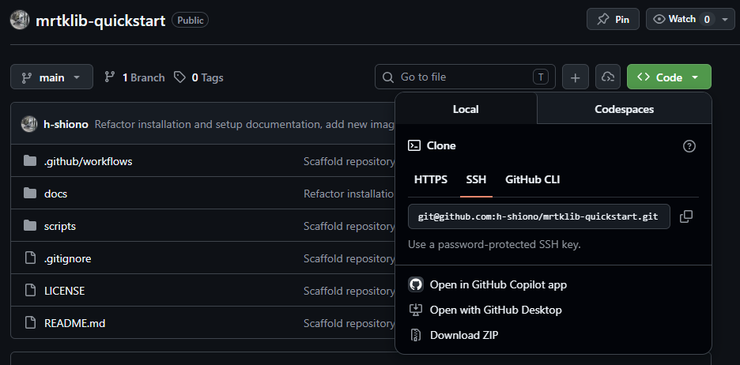
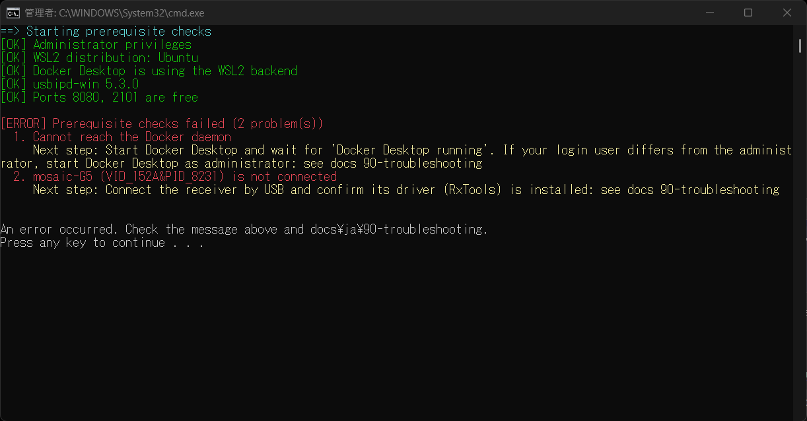
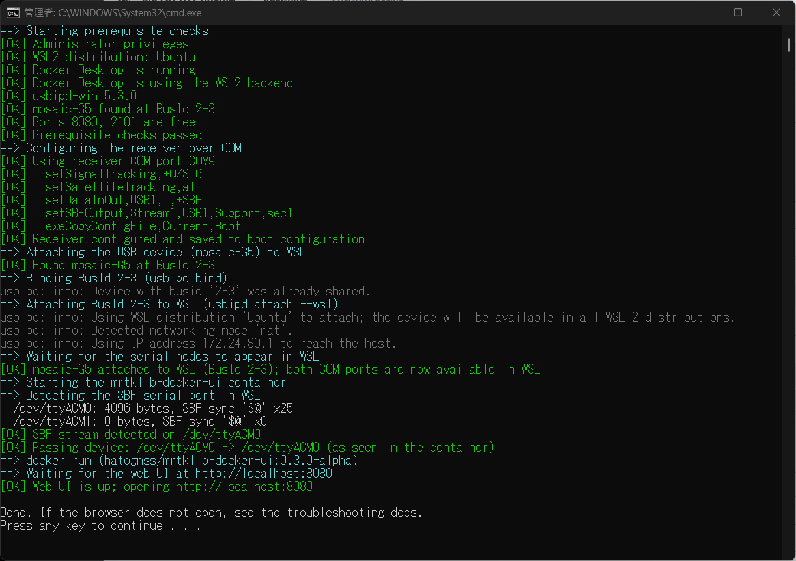
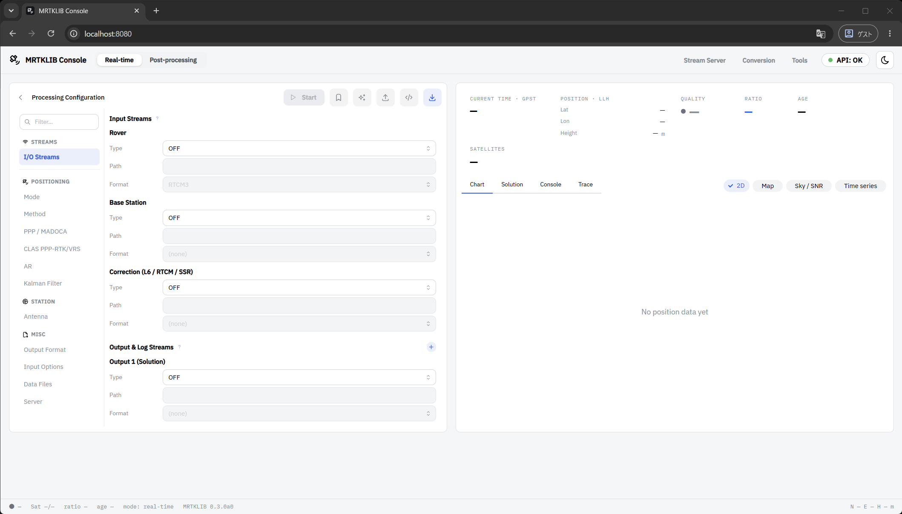

# 起動（Windows）

<!-- Windows: how to run start.bat, getting past SmartScreen. -->

## mrtklib-quickstart のダウンロード {#sec-win-quickstart-download}

[https://github.com/h-shiono/mrtklib-quickstart](https://github.com/h-shiono/mrtklib-quickstart) にアクセスし、`<> Code` > `Download ZIP` で `mrtklib-quickstart` をダウンロードしてください。
ダウンロード後、`mrtklib-quickstart-main.zip` を任意のフォルダに解凍・展開してください。



!!! note "ノート"

    git が使える方は、`git clone` でリポジトリをクローンする方法でも問題ありません。
    ```bash
    git clone git@github.com:h-shiono/mrtklib-quickstart.git
    ```

## MRTKLIB の起動 {#sec-win-mrtklib-run}

### 実行前チェック {#sec-win-mrtklib-run-precheck}

実行前に必ず以下を確認してください。

1. **受信機とアンテナを接続**
2. **受信機を USB 接続**
3. **Docker Desktop の起動**
    - ログインユーザと管理者ユーザが異なる場合 → [Docker Desktop を管理者権限で起動する](90-troubleshooting.md#sec-troubleshooting-docker-admin)

!!! note "ノート"

    Docker Desktop が起動しているかを確認するには、タスクバーの `^` から隠れているインジケーターを表示します。
    🐳のアイコンにカーソルを重ね、`Docker Desktop Running` と表示されれば Docker Desktop は起動中です。

### バッチファイルの実行 {#sec-win-mrtklib-run-batch}

`scripts/windows/start.bat` をダブルクリックして実行します。
実行すると「**開いているファイル - セキュリティの警告**」という画面が表示され、「**発行元を確認できませんでした。このソフトウェアを実行しますか?**」と尋ねられます。「**実行**」をクリックして続行してください。

!!! note "ノート"

    環境によっては、代わりに「**WindowsによってPCが保護されました**」という画面（Microsoft Defender SmartScreen）が表示される場合があります。
    その場合は「**詳細情報**」をクリックすると「**実行**」ボタンが現れるので、それをクリックして続行してください。

    `start.bat` は本ガイドが提供するスクリプトです。中身は `scripts/windows/` 以下で確認できます。

!!! note "ノート"

    バッチファイルは次の処理を行います。

    1. **前提条件の確認**: MRTKLIB とその Web UI を動かすための前提条件が揃っているかを確認します。
    2. **受信機の設定**: mosaic-G5 に QZS L6 信号受信および、Raw データ出力の設定を行います。
    3. **USB のアタッチ**: Docker コンテナで USB 機器を使用するには、usbipd を使って Windows から WSL2 へUSBをアタッチし、さらにそれをDockerコンテナへデバイスマウント（パススルー）する必要があります。
    4. **Docker コンテナの起動**: `mrtklib-docker-ui` を Docker Hub から取得、起動します。
    5. **Web ブラウザの起動**: Web ブラウザを起動し、MRTKLIB Console を表示します。

実行後、再度同じセキュリティの警告が表示されますので、再び「実行」をクリックします。

続いて画面に「このアプリがデバイスに変更を加えることを許可しますか？」と表示されるので、「はい」を選択します。

### 前提条件の確認 {#sec-win-mrtklib-run-prereq-check}

`[OK]` が表示されていることを確認します。

```powershell
==> Starting prerequisite checks
[OK] Administrator privileges
[OK] WSL2 distribution: Ubuntu
[OK] Docker Desktop is running
[OK] Docker Desktop is using the WSL2 backend
[OK] usbipd-win 5.3.0
[OK] mosaic-G5 found at BusId 1-4
[OK] Ports 8080, 2101 are free
[OK] Prerequisite checks passed
```

!!! note "ノート"

    `[OK]` にならなかった項目がある場合は、次のように**不足しているものがまとめて**表示され、処理は中断されます。
    表示された `Next step` に従って対処し、`start.bat` を実行し直してください。

    

    ```powershell
    [ERROR] Prerequisite checks failed (2 problem(s))
      1. Cannot reach the Docker daemon
         Next step: Start Docker Desktop and wait for 'Docker Desktop running'. ...
      2. mosaic-G5 (VID_152A&PID_8231) is not connected
         Next step: Connect the receiver by USB and confirm its driver (RxTools) ...
    ```

### 受信機の設定 {#sec-win-mrtklib-run-receiver}

`[OK]` が表示されていることを確認します。

```powershell
==> Configuring the receiver over COM
[OK] Using receiver COM port COM9
[OK]   setSignalTracking,+QZSL6
[OK]   setSatelliteTracking,all
[OK]   setSBFOutput,Stream1,USB1,Support,sec1
[OK]   setDataInOut,USB1, ,+SBF
[OK]   exeCopyConfigFile,Current,Boot
[OK] Receiver configured and saved to boot configuration
```

### USB のアタッチ {#sec-win-mrtklib-run-usb-attach}

`[OK]` が表示されていることを確認します。

```powershell
==> Attaching the USB device (mosaic-G5) to WSL
[OK] Found mosaic-G5 at BusId 1-4
==> Binding BusId 1-4 (usbipd bind)
usbipd: info: Device with busid '1-4' was already shared.
==> Attaching BusId 1-4 to WSL (usbipd attach --wsl)
usbipd: info: Using WSL distribution 'Ubuntu' to attach; the device will be available in all WSL 2 distributions.
usbipd: info: Detected networking mode 'nat'.
usbipd: info: Using IP address 172.24.80.1 to reach the host.
[OK] mosaic-G5 attached to WSL (BusId 1-4); both COM ports are now available in WSL
```

### Docker コンテナの起動 {#sec-win-mrtklib-run-container}

`[OK]` が表示されていることを確認します。

```powershell
==> Starting the mrtklib-docker-ui container
==> Detecting the SBF serial port in WSL
  /dev/ttyACM0: 4096 bytes, SBF sync '$@' x24
  /dev/ttyACM1: 0 bytes, SBF sync '$@' x0
[OK] SBF stream detected on /dev/ttyACM0
[OK] Passing device: /dev/ttyACM0 -> /dev/ttyACM0 (as seen in the container)
```

!!! note "ノート"

    受信機は2つの仮想 COM ポートを持ち、SBF が出ている方は環境によって `ttyACM0` にも `ttyACM1` にもなります。
    バッチファイルは検出した方のポートだけを、**コンテナ内では必ず `/dev/ttyACM0`** として渡します。
    そのため、後ほど UI で設定するパスは常に `ttyACM0` です。

### Web ブラウザの起動 {#sec-win-mrtklib-run-browser}

`[OK]` が表示されていることを確認します。

```powershell
==> docker run (hatognss/mrtklib-docker-ui:0.3.0-alpha)
==> Waiting for the web UI at http://localhost:8080
[OK] Web UI is up; opening http://localhost:8080
```


**start.bat 実行画面**

`[OK] Web UI is up; opening http://localhost:8080` が表示された後、Web ブラウザが起動して MRTKLIB Console の画面が表示されます。



以上にて、MRTKLIB と Web UI の起動が完了しました。

## 次のステップ

- [UI の使い方](50-using-ui.md) へ
- うまくいかない場合 → [トラブルシューティング](90-troubleshooting.md)
