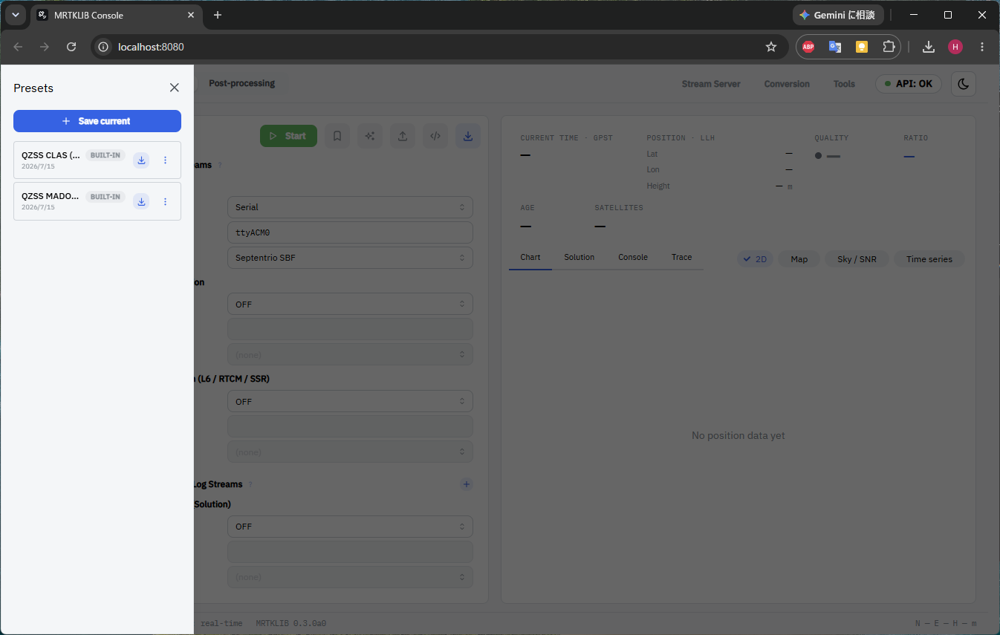
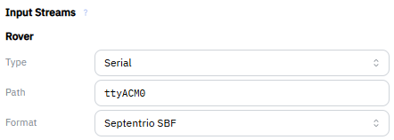
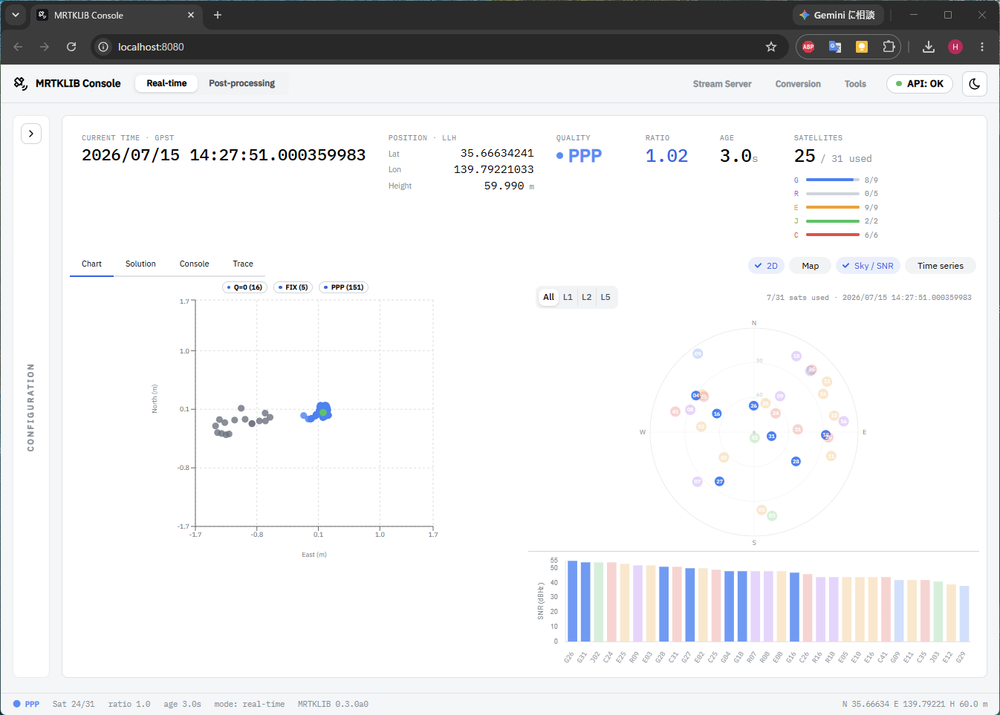

<!-- Reading the convergence curve (OS-independent, the educational core). -->

## Real-time PPP 測位処理の実行 {#sec-run-ppp}

### 設定ファイルの読み込み {#sec-run-ppp-load-preset}

栞のアイコンをクリックすると、Preset が開きます。

`QZSS MADOCA (BUILT-IN)` と書かれた Preset をダウンロードします。
`Load preset will overwrite current settings. Continue?` と聞かれるので、`Load` をクリックして読み込みます。

読み込みに成功すると `"QZSS MADOCA (PPP-Kinematic)" loaded` と表示されます。

### ローバの設定 {#sec-run-ppp-configure-rover}

`Input Streams` > `Rover` に、次の値を設定します。

| 項目 | 設定値 |
| --- | --- |
| Type | Serial |
| Path | ttyACM*（※検出されたパス） |
| Format | Septentrio SBF |
: ローバの設定 {#tbl-setup-rover}

::: {.callout-note}
ここで設定する `Path` は、バッチファイル実行時に `[OK] SBF stream detected on /dev/ttyACM*` と表示された方のパスを記載します（Docker コンテナの起動 参照）。
:::

### 測位処理の実行 {#sec-run-ppp-start}

`Start` をクリックして測位処理を開始します。
初回実行時は、航法データの取得が必要なため測位がはじまるまで少し時間がかかります。

広域電離圏補正により、条件が良ければ数分で FIX 解が得られます。

## 以上で MADOCA-PPP の体験は完了です 🎉 {.unnumbered}

体験を終えるときは、[終了処理（Windows）](60-stop-windows.qmd) を行いコンテナの停止と USB のデタッチを行ってください。

さらに学びたい方は、以下のリンクを参考にしてください。

- [みちびき Web](https://qzss.go.jp/index.html)
- [Septentrio mosaic-G5 P3](https://www.septentrio.com/ja/products/gnss-receivers/gnss-receiver-modules/mosaic-G5-P3)
- [MRTKLIB](https://github.com/h-shiono/MRTKLIB)
- [mrtklib-docker-ui](https://github.com/h-shiono/mrtklib-docker-ui)
- [Zenn (hato.GNSS)](https://zenn.dev/hatognss)

## うまくいかない場合 {.unnumbered}

- [トラブルシューティング](90-troubleshooting.qmd)
