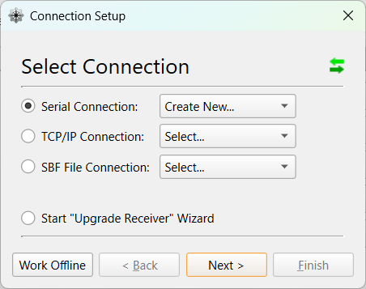
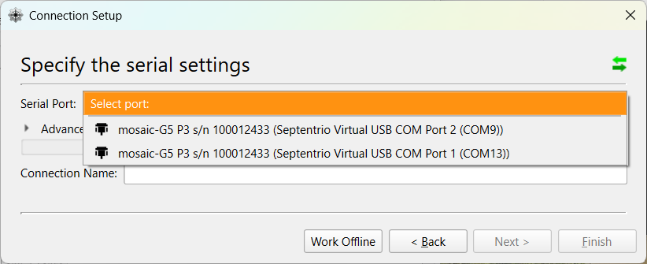
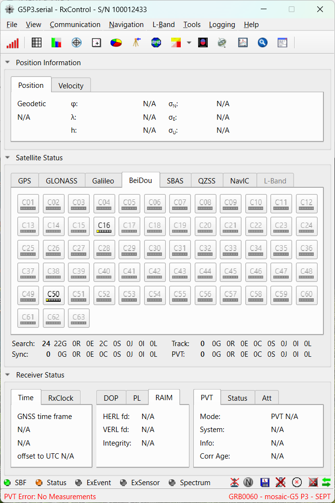
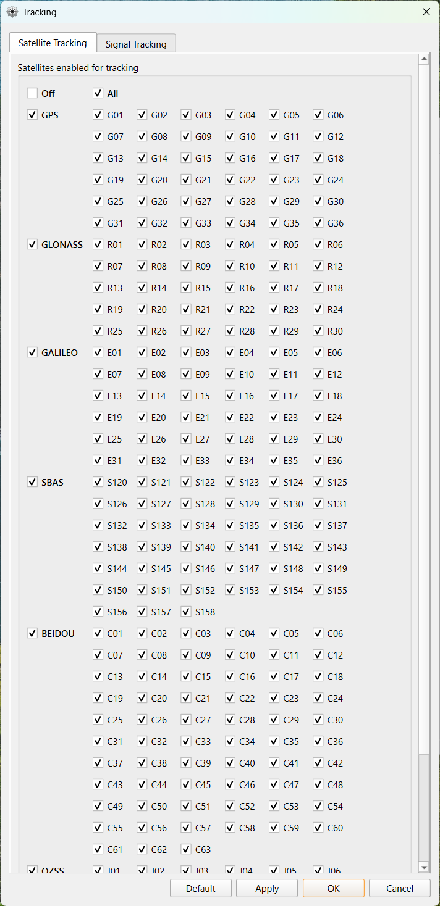
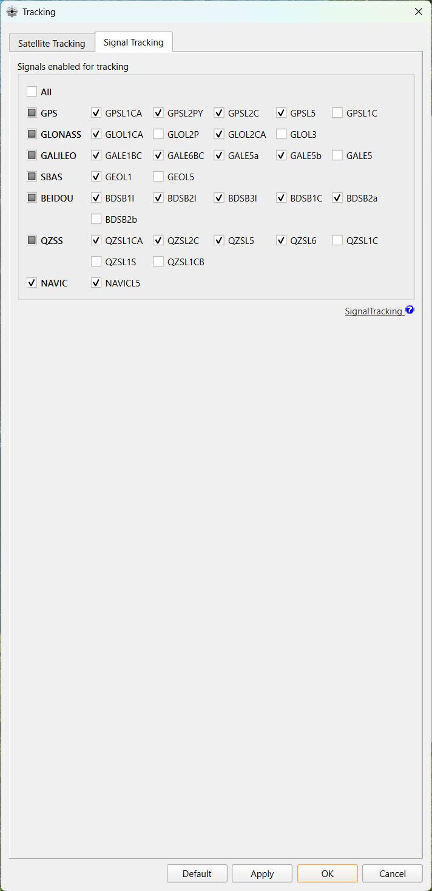
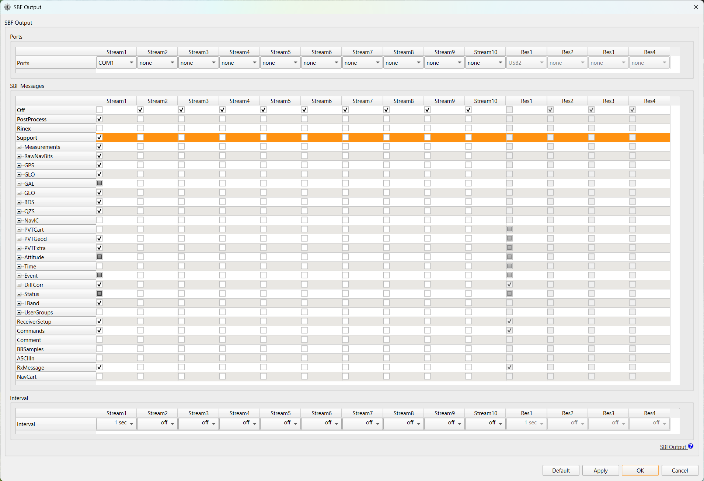
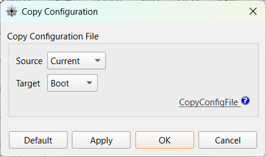

<!-- Appendix: manual receiver configuration via RxControl.
     The start script configures the receiver automatically; this chapter is
     for understanding what it does and for manual fallback / verification.
     Consolidates the former Windows/Linux and macOS receiver-setup chapters. -->

::: {.callout-note}
起動スクリプト（`start.bat`）は、本章の設定を**自動で行います**。本章は、**その仕組みを理解したい場合**や、**自動設定がうまくいかず手動で設定・確認したい場合**のための参照です。
:::

## なぜこの設定が必要か

MADOCA-PPP による測位は、「**①受信機が測った生の観測データ**」と「**②QZSS L6 から届く補正情報**」を突き合わせて計算します。この計算を行うのはコンテナ内の MRTKLIB エンジンなので、受信機には**両方を SBF 形式で出力させる**必要があります。以下の設定は、そのための最小構成です。

| 設定 | なぜ必要か |
|---|---|
| **QZSL6 信号を追尾** | L6 補正を復号するため。`QZSRawL6E`（MADOCA-PPP：軌道・クロック・バイアス補正）と `QZSRawL6D`（広域電離圏補正）が得られます |
| **全星座を追尾（All）** | 補強対象の GPS / GLONASS / Galileo / BeiDou / QZSS の観測量を確保するため |
| **SBF を `USB1` に出力** | コンテナは USB シリアル経由で SBF を読みます。`COM1` は物理シリアルで USB には出ないため `USB1` を選びます |
| **`Support` メッセージ群** | 生観測（`MeasEpoch`）・各種 Nav・`QZSRawL6D/E` をまとめて含み、これ一つで PPP に必要な入力が揃うため |
| **`Boot` に保存** | 電源を入れ直しても設定が残るようにするため |

以下は、上記を RxControl の GUI で手動設定する手順です（Windows / Linux 共通、画面は Windows）。

## 受信機の接続（Windows, Linux）

::: {.callout-caution}
先に「RxTools」のインストールを完了させてから本節をお読みください。
:::

USB ケーブルを使用して、受信機を Windows または Linux の PC に接続します。
正常に接続されると、受信機の PWR LED が赤色に点灯します。

## 受信機の設定（Windows, Linux）

::: {.callout-note}
RxControl では、ダイアログによってポートの呼び方が異なります（接続設定では `Port 2`、SBF 出力設定では `COM1` のように表記が揺れます）。これは Septentrio のツール側の仕様です。混乱しやすいので、各手順ではスクリーンショットに示されたポートをそのまま選択してください。
:::

### RxControl の起動

`RxControl` を起動します。

初回起動時は、`Connection Setup` ダイアログが表示されます。
`Serial Connection` > `Create New...` を選択し、`Next >` をクリックします。

`Serial Port` に接続した受信機の COM ポートが2つ表示されますので、`Port 2` を選択します。
`Connection Name` に任意の名前を設定し、`Finish` をクリックします。

正常に接続されると、`RxControl` のメイン画面が表示されます。

### 受信衛星・信号の設定

`Navigation` > `Advanced User Settings` > `Tracking...` を開きます。

`Satellite Tracking` タブで、`All` にチェックを入れます。

::: {.callout-note}
MADOCA-PPP では、`GPS`, `GLONASS`, `Galileo`, `BDS`, `QZSS` をサポートしています。
:::

次に、`Signal Tracking` タブで、`QZSL6` にチェックを入れます。

::: {.callout-note}
MADOCA-PPP の利用には、`QZSRawL6E` が必要になります。
今回は技術実証中の広域電離圏補正を使った PPP-AR/Iono 測位を行うため、`QZSRawL6D` も併せて必要になります。
`QZSL6` にチェックを入れることで、`QZSRawL6D`, `QZSRawL6E` を受信することが可能になります。
:::

最後に、`Apply` > `OK` をクリックして設定を反映します。

### SBF 出力の設定

`Communication` > `Output Settings` > `SBF Output...` を開きます。

- `Stream 1` の `Ports` を `USB1` に設定し、`SBF Messages` の `Support` にチェックを入れます。
- `Interval` を `1 sec` に設定します。

::: {.callout-important}
出力先は必ず `USB1` を選択してください。`COM1` は物理シリアルポートのため、USB 経由でコンテナに SBF が届きません。
:::

最後に、`Apply` > `OK` をクリックして設定を反映します。

### 受信機設定の保存

`File` > `Copy Configuration` を開きます。

`Source` に `Current`、`Target` に `Boot` をそれぞれ設定し、`Apply` > `OK` をクリックして設定を反映します。

以上にて、受信機の設定は完了です。

## 受信機の設定（macOS）

TBD
