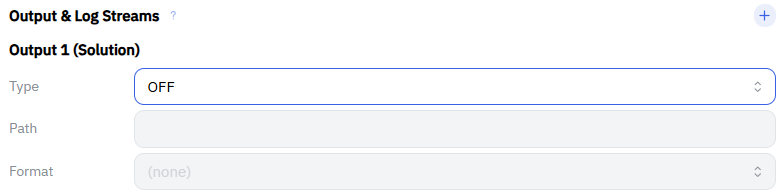
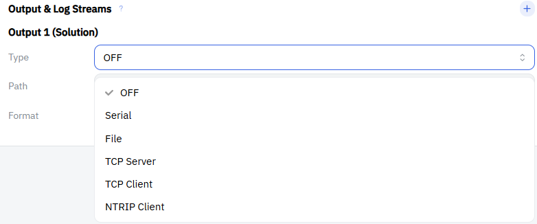

<!-- Appendix: feeding the MRTKLIB solution to an external consumer.

     Structure rationale:
       - File      : zero setup (the /workspace volume is already mounted rw)
       - TCP Server: the OS-independent primary route; needs a published port
       - Serial    : Windows(WSL) / Linux only. Docker Desktop for Mac has no
                     serial/--device passthrough (see scripts/macos/README.md)
       - NTRIP / TCP Client: outbound, so no port publishing is needed

     Settled:
       - The published TCP port is 2101 (common.ps1 $OutPort), matching the
         UI's tcpsvr placeholder. Port conflicts are covered by
         90-troubleshooting.qmd#sec-troubleshooting-port-in-use.
       - run-container.ps1 passes only the SBF node, pinned to /dev/ttyACM0 in
         the container. The receiver's CON node stays in WSL, unused.

     Sources for the less obvious claims here (read off the code, not guessed):
       - tcpsvr always binds INADDR_ANY: gentcp() in MRTKLIB
         src/stream/mrtk_stream.c leaves sin_addr zeroed for type==0, so an
         address in the path is parsed and then ignored. Restricting the
         audience has to happen at the docker publish, on the host side.
       - The output slot's "NTRIP Client" acts as an NTRIP *server*: the UI
         writes type="ntrip", and rtkrcv's OSTOPT list has no ntripcli, so
         str2enum() substring-matches "5:ntripsvr" (apps/rtkrcv/rtkrcv.c).
       - ::S= takes hours as a float: sscanf(p+2,"S=%lf") in openfile().
       - The mrtk process inherits the server's cwd, /app (Dockerfile WORKDIR),
         so a relative output path is NOT written to the mounted volume.

     TODO(open decision):
       - Serial: attaching additional USB devices is not implemented yet
         (an opt-in VID:PID list was proposed). Until then this chapter
         documents the manual usbipd + one-line script edit procedure.

     CAUTION for the macOS / Linux implementations:
       「UI の Path は常に ttyACM0」is now asserted OS-independently in
       10-concepts.qmd, 50-using-ui.qmd and 90-troubleshooting.qmd. When
       scripts/macos/lib and the Linux equivalent are written, they MUST
       reproduce the same `--device <detected>:/dev/ttyACM0` renaming, or
       those three statements become wrong.
-->

## 概要 {#sec-output-overview}

MRTKLIB の測位結果は様々な形で外部出力し、利活用することができます。
本章では出力方法に応じた設定方法を説明します。

出力の設定は、UI の `Output & Log Streams` にある `Output 1 (Solution)` で行います。
複数の出力設定を行いたい場合には、`Output & Log Streams` の右側にある `+` をクリックすることで、出力設定を増やすことができます。



| 出力方法 | 主な用途 | 対応 OS | 事前準備 |
| --- | --- | --- | --- |
| [File](#sec-output-file) | ログとして保存し、後から解析する | Windows / macOS / Linux | 不要 |
| [TCP/IP Server](#sec-output-tcpsvr) | 別アプリ・別端末からリアルタイムに受け取る | Windows / macOS / Linux | 不要 |
| [Serial（USB）](#sec-output-serial) | 外部機器へリアルタイムに流し込む | Windows / Linux のみ | 必要（手動） |
| [NTRIP / TCP Client](#sec-output-client) | 外部サーバへ送信する | Windows / macOS / Linux | 不要 |

::: {.callout-important}
ここで扱うのは**測位結果（解）**の出力です。
現在の `mrtklib-docker-ui` ではリアルタイム測位と並行して受信機から届く Raw データ（SBF）をそのまま保存することができません。
近日中に Raw データ保存にも対応できるように検討中です。
:::

## 出力方法の選択 {#sec-output-type}

`Type` をクリックすると、出力方法をプルダウンから選択できます。



`Type` を選ぶと `Path` と `Format` が入力できるようになります。
`Path` の書式は出力方法ごとに異なるため、以下の各節を参照してください。
`Output & Log Streams` の見出しの右にある `?` アイコンからも、書式の一覧を確認できます。

## 出力フォーマットの選択 {#sec-output-format}

`Format` は `NMEA` を選択します。
測位結果は NMEA センテンス（`$GPGGA` など）として出力され、多くのアプリケーションがそのまま解釈できます。

## File 出力 {#sec-output-file}

ファイル出力を行う場合は、`Type` と `Path` をそれぞれ以下のように設定します。

| 項目 | 設定内容 |
| --- | --- |
| **Type**    | `File` |
| **Path**    | `/workspace/G5P3%n%H.nmea::S=1` |
| **Format**  | `NMEA` |

`/workspace` はホストの `{path to mrtklib-quickstart}/mrtklib-quickstart-data/workspace` にマウントされています。
ファイル名の例 `G5P3%n%H.nmea` は受信機名が `G5P3`、`%n` が年通算日 (Day of Year)、`%H` が時間コード (a=0,b=1,..x=23) をそれぞれ表します。

::: {.callout-important}
`Path` は必ず `/workspace/` から始まる**絶対パス**で指定してください。
相対パス（例：`workspace/out.nmea`）はコンテナ内の別の場所に書き込まれるため、**ホストからは見えず、コンテナを停止・削除すると失われます**。
:::

### 時刻の指定子 {#sec-output-file-keyword}

`%n`、`%H` 以外にも以下の指定子が利用可能です。

| 指定子 | 意味 |
| --- | --- |
| %Y | Year (yyyy) |
| %y | Year (yy) |
| %m | Month (mm) |
| %d | Day of Month (dd) |
| %n | Day of Year (ddd) |
| %W | GPS Week No. (wwww) |
| %D | Day of Week |
| %h | Hour (00-23) |
| %M | Minute (00-59) |
| %S | Second (00-59) |
| %H | Hour code (a,b,...,x) |
| %t | 15 分単位の分 (00,15,30,45) |

### ファイルの分割 {#sec-output-file-swap}

パスの末尾に付けた `::S=` は、ファイルを分割する間隔を**時間単位**で指定するものです。

| 指定 | 動作 |
| --- | --- |
| `::S=1` | 1 時間ごとに新しいファイルへ切り替える |
| `::S=24` | 24 時間ごとに切り替える |
| `::S=0.5` | 30 分ごとに切り替える |
| 指定なし | 分割せず 1 つのファイルに書き続ける |

分割を使う場合は、ファイル名に時刻の指定子を必ず含めてください。
含めないと、切り替えのたびに同じ名前のファイルへ上書きされてしまいます。

## TCP/IP Server 出力 {#sec-output-tcpsvr}

MRTKLIB を TCP サーバとして動作させ、別のアプリケーションや別の端末から接続して測位結果を受け取ります。

| 項目 | 設定内容 |
| --- | --- |
| **Type**    | `TCP Server` |
| **Path**    | `:2101` |
| **Format**  | `NMEA` |

`Path` は `:` に続けてポート番号を書きます。

::: {.callout-important}
外部へ公開されているポートは **`2101` のみ**です。UI で別のポート番号を指定しても外部からは接続できません。
公開ポート自体を変更したい場合は [使用するポートを変更する](90-troubleshooting.qmd#sec-troubleshooting-port-change) を参照してください。
:::

### 接続の確認 {#sec-output-tcpsvr-verify}

同じ PC から確認する場合は、PowerShell で次のコマンドを実行します。
`TcpTestSucceeded : True` と表示されれば、ポートまで到達できています。

```powershell
Test-NetConnection localhost -Port 2101
```

::: {.callout-note}
このコマンドが確認するのは、ポートに到達できるかどうかだけです。実際に測位結果が流れているかは、接続先のアプリケーションで NMEA センテンスが受信できることをもって確認してください。
:::

別の端末から接続する場合は、`localhost` の代わりに MRTKLIB を動かしている PC の IP アドレスを指定します。IP アドレスは次のコマンドで確認できます。

```powershell
ipconfig
```

### 公開範囲についての注意 {#sec-output-tcpsvr-security}

::: {.callout-warning}
このポートは既定で `0.0.0.0`（すべてのネットワークインタフェース）で公開されるため、**同じ LAN 上の任意の端末から接続できます**。
MRTKLIB の TCP Server に認証機能はありません。
共用の Wi-Fi など、信頼できないネットワークで使用する場合はご注意ください。
:::

`Path` にアドレスを書いても公開範囲は変わりません。
MRTKLIB の TCP Server は、パスに何を書いても常にすべてのインタフェースで待ち受けます。
同じ PC の中だけで使いたい場合は、`scripts\windows\lib\run-container.ps1` の公開指定を次のように書き換えてください。

```powershell
'-p', "127.0.0.1:${OutPort}:${OutPort}"
```

## Serial（USB）出力 {#sec-output-serial}

USB シリアル変換器などを介して、外部機器へ測位結果を流し込みます。

::: {.callout-warning}
Serial 出力は **Windows（WSL 経由）と Linux でのみ**利用できます。
Docker Desktop for Mac はシリアルデバイスのパススルーに対応していないため、macOS では利用できません。
macOS では [TCP/IP Server 出力](#sec-output-tcpsvr) をご利用ください。
:::

::: {.callout-important}
出力先となる機器は多岐にわたるため、**自動設定の対象外**です。
以下の手順は手作業になります。
また、コンテナへ渡すデバイスは起動時にしか指定できません。
**必ず `start.bat` を実行する前に**出力先の機器を接続してください。
コンテナの起動後に接続しても認識されません。
:::

### 出力先デバイスの接続 {#sec-output-serial-attach}

受信機と同じように、出力先の機器も WSL へアタッチする必要があります。

出力先の機器を USB 接続し、管理者権限の PowerShell（[PowerShell を管理者権限で起動](20-install-windows.qmd#sec-win-wsl2-powershell)）で、接続されている USB 機器の一覧を表示します。

```powershell
usbipd list
```

出力先の機器の `BUSID` を確認し、共有してから WSL へアタッチします。`X-Y` は確認した `BUSID` に読み替えてください。

```powershell
usbipd bind --busid X-Y
usbipd attach --wsl --busid X-Y
```

WSL 側でデバイス名を確認します。

```powershell
wsl ls /dev/ttyUSB* /dev/ttyACM*
```

FTDI や CP210x、CH340 といった一般的な USB シリアル変換器は `/dev/ttyUSB0` のように現れます。
ここで確認した名前を、次の手順と UI の設定で使用します。

### コンテナへのデバイスの追加 {#sec-output-serial-device}

`start.bat` がコンテナへ渡すのは、受信機の SBF が流れているポート 1 本だけです。
出力先の機器を渡すには、`scripts\windows\lib\run-container.ps1` の次の行を書き換えます。

```powershell
$deviceArgs = @('--device', "${sbfDevice}:${ContainerDevice}",
                '--device', '/dev/ttyUSB0:/dev/ttyUSB0')
```

`/dev/ttyUSB0` は前の手順で確認した名前に読み替えてください。

書き換えたら、`stop.bat` を実行してから `start.bat` を実行し直します。コンテナが作り直され、追加したデバイスが渡されます。

::: {.callout-note}
出力先が Arduino のような CDC-ACM 機器（`/dev/ttyACM*` として現れるもの）の場合、`start.bat` の SBF ポート検出処理が起動時に約 3 秒間そのポートを読みにいきます。
読み出しで副作用がある機器では注意してください。
:::

### UI の設定 {#sec-output-serial-config}

| 項目 | 設定内容 |
| --- | --- |
| **Type**    | `Serial` |
| **Path**    | `ttyUSB0:115200` |
| **Format**  | `NMEA` |

`Path` は `デバイス名:ボーレート` の形式で指定します。先頭の `/dev/` は不要です。
ボーレートは出力先の機器側の設定に合わせてください。

::: {.callout-note}
`ttyACM0` は受信機の入力（Rover）で使用しているポートです。出力先として指定しないでください。
:::

### 終了時のデタッチ {#sec-output-serial-detach}

`stop.bat` がデタッチするのは受信機（mosaic-G5）だけです。
追加した出力先の機器は WSL にアタッチされたまま残り、Windows からは見えない状態が続きます。

`stop.bat` を実行したあと、管理者権限の PowerShell で手動でデタッチしてください。

```powershell
usbipd detach --busid X-Y
```

## NTRIP / TCP Client 出力 {#sec-output-client}

外部のサーバへ測位結果を送信します。
MRTKLIB 側から接続しにいく外向きの通信なので、ポートの公開は不要です。

### NTRIP {#sec-output-client-ntrip}

NTRIP キャスタへ測位結果を送信します。

| 項目 | 設定内容 |
| --- | --- |
| **Type**    | `NTRIP Client` |
| **Path**    | `[:passwd@]addr[:port]/mountpoint` |
| **Format**  | `NMEA` |

::: {.callout-important}
`Type` の表示は `NTRIP Client` ですが、**出力に設定した場合は NTRIP サーバ（キャスタへ送信する側）として動作します**。
そのため `Path` は上記の書式になり、入力側で使う NTRIP クライアントの書式（`user:passwd@...`）とは異なります。
ユーザ名は指定せず、パスワードとマウントポイントを指定してください。
:::

例：`:mypassword@rtk2go.com:2101/MYMOUNT`

### TCP Client {#sec-output-client-tcp}

任意の TCP サーバへ接続して、測位結果を送信します。

| 項目 | 設定内容 |
| --- | --- |
| **Type**    | `TCP Client` |
| **Path**    | `addr[:port]` |
| **Format**  | `NMEA` |

例：`192.168.1.100:2101`

## うまくいかない場合 {.unnumbered}

- [トラブルシューティング](90-troubleshooting.qmd)
