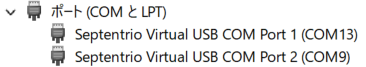

<!-- Organized by symptom. Windows-first; macOS/Linux specifics are TODO. -->

うまく動かないときは、まず表示されたエラーメッセージ（`[ERROR]` の行と `Next step:` のヒント）を確認してください。以下は症状別の対処です。

## 受信機（COM ポート）が見つからない

`No Septentrio COM port found` や `mosaic-G5 ... is not connected` と表示される場合。

- **受信機が USB 接続されているか** — ケーブルを挿し直し、受信機の `PWR` LED が赤色に点灯していることを確認します。
- **RxTools がインストールされているか** — 受信機を USB シリアルとして認識させるドライバは RxTools が提供します。インストールしていない場合は[インストール（Windows）](20-install-windows.qmd)を参照してください。
- **RxControl など、他のアプリケーションが COM ポートを掴んでいないか** — RxControl を開いていると COM ポートを占有します。閉じてから再実行してください。
- **既に WSL へアタッチ済みでないか** — 一度 WSL にアタッチすると Windows からは COM ポートが見えません。`scripts\windows\detach.bat` でデタッチしてから再実行します。

::: {.callout-tip}
デバイスマネージャーの「ポート (COM と LPT)」に `Septentrio Virtual USB COM Port` が2つ表示されていれば、Windows は受信機を認識できています。

{#fig-device-manager}
:::

## SBF ストリームが検出されない

`No SBF stream detected on the receiver's ports`、または検出時に両ポートが `0 bytes` と表示される場合。

- **SBF の出力先が `USB1` になっているか** — `COM1`（物理シリアル）に出力していると USB 側には届きません。通常は `start.bat` が自動設定しますが、手動設定で上書きしている場合は[付録：受信機の手動設定](80-appendix-receiver-setup.qmd)を確認してください。
- **`QZSL6` の Tracking が有効か** — 補正情報（`QZSRawL6D/E`）が出力されているか、同じく付録をご参照ください。

::: {.callout-note}
SBF の `Support` 群は測位できていなくても出力されます。両ポートが `0 bytes` の場合は「衛星が見えない」ではなく「出力先ポートの設定」を疑ってください。
:::

## セキュリティ警告で実行できない

- **「開いているファイル - セキュリティの警告」** — 「実行」をクリックします。
- **「WindowsによってPCが保護されました」（SmartScreen）** — 「詳細情報」をクリックすると「実行」が現れるので、これをクリックします。詳細は[起動（Windows）](30-run-windows.qmd)をご参照ください。

## 管理者権限のエラー（usbipd bind failed）

`usbipd bind failed` や「管理者権限が必要」と表示される場合。

- `start.bat` は実行時に管理者権限を求めます。「このアプリがデバイスに変更を加えることを許可しますか？」で**「はい」**を選んでください。誤って「いいえ」を選んだ場合は、もう一度 `start.bat` を実行してください。

## コンテナが起動しない

`docker run failed` や `docker command not found`、あるいは起動が進まない場合。

- **Docker Desktop が起動しているか** — タスクバーの隠れているインジケーターで 🐋 にカーソルを重ね、`Docker Desktop running` を確認します。起動していなければ Docker Desktop を起動してから再実行してください。
- **`docker command not found`** — Docker Desktop 自体が未インストールです。[インストール（Windows）](20-install-windows.qmd)をご参照ください。
- **ポート 8080 が使用中** — 既存コンテナや他アプリが 8080 番を使っていると起動に失敗します。次のコマンドで既存コンテナを削除してから再実行します。

  ```ps
  docker rm -f mrtklib-web-ui
  ```

- **イメージの取得（pull）が遅い / 失敗する** — 初回はイメージのダウンロードに数分かかります。ネットワークを確認し、時間をおいて再実行してください。
- **起動直後に落ちる** — 次のコマンドでログを確認します。

  ```ps
  docker logs mrtklib-web-ui
  ```

## ブラウザで UI が開かない

- **初回はイメージ取得に時間がかかる** — 起動待ちがタイムアウトしても、コンテナは動いている場合があります。少し待ってから手動で [http://localhost:8080](http://localhost:8080) を開いてください。
- **コンテナが動いているか確認** — 次のコマンドで `mrtklib-web-ui` が `Up` かを確認します。無ければ `start.bat` を再実行します。

  ```ps
  docker ps
  ```

  動作している場合
  ```ps
  CONTAINER ID   IMAGE                                    COMMAND                   CREATED          STATUS                    PORTS                                         NAMES
  afa58c127340   hatognss/mrtklib-docker-ui:0.3.0-alpha   "uvicorn mrtklib_web…"   47 seconds ago   Up 46 seconds (healthy)   0.0.0.0:8080->8000/tcp, [::]:8080->8000/tcp   mrtklib-web-ui
  ```

  動作していない場合
  ```ps
  CONTAINER ID   IMAGE     COMMAND   CREATED   STATUS    PORTS     NAMES
  ```

## 測位が始まらない / FIX しない

- **UI の `Path` が正しいか** — バッチ実行時に `[OK] SBF stream detected on /dev/ttyACM*` と表示された方のパスを設定します（[UI の使い方](50-using-ui.qmd)）。
- **アンテナが遮蔽されていないか** — 屋内や上空が遮られる場所では衛星を捕捉できません。空の開けた場所にアンテナを設置してください。
- **初回は航法データの取得に時間がかかる** — 測位が始まるまで数分待ちます。
- **QZSS L6 が受信できているか** — MADOCA-PPP は QZSS L6 の補正情報が必要です。QZS の可視状況（仰角）を確認してください。

<!-- TODO: macOS / Linux 固有の症状（ドライバ、/dev パス、権限）を小節として追加。 -->
